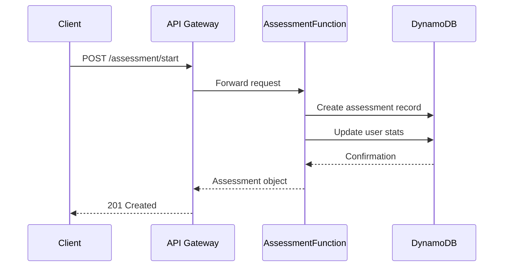
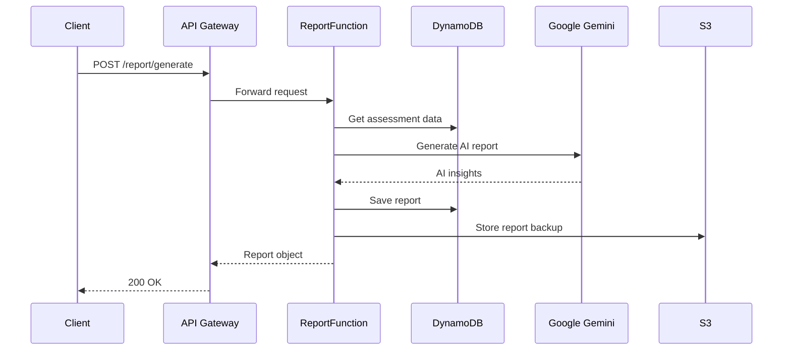
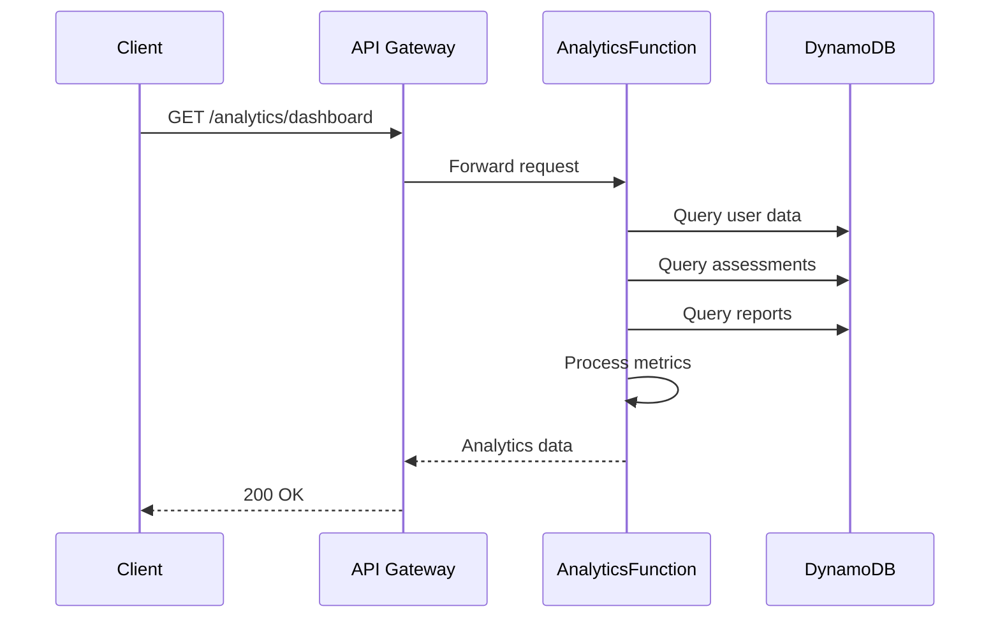

# 🏗️ **System Architecture**
## AWS Lambda Serverless Therapy App

---

## 📊 **High-Level Architecture**

```
┌─────────────────────────────────────────────────────────────────┐
│                        Client Applications                      │
│  ┌─────────────┐  ┌─────────────┐  ┌─────────────┐             │
│  │   Web App   │  │ Mobile App  │  │  Admin UI   │             │
│  └─────────────┘  └─────────────┘  └─────────────┘             │
└─────────────────────────────────────────────────────────────────┘
                                │
                                ▼
┌─────────────────────────────────────────────────────────────────┐
│                      AWS API Gateway                           │
│              ┌─────────────────────────────┐                   │
│              │      REST API Endpoints     │                   │
│              │   - CORS Enabled           │                   │
│              │   - Rate Limiting          │                   │
│              │   - Request Validation     │                   │
│              └─────────────────────────────┘                   │
└─────────────────────────────────────────────────────────────────┘
                                │
                                ▼
┌─────────────────────────────────────────────────────────────────┐
│                     Lambda Functions                           │
│  ┌─────────────┐  ┌─────────────┐  ┌─────────────┐  ┌────────┐ │
│  │AuthFunction │  │AssessmentFn │  │ ReportFn    │  │Analytics│ │
│  │             │  │             │  │             │  │Function │ │
│  │- Register   │  │- Start      │  │- Generate   │  │- Metrics│ │
│  │- Login      │  │- Update     │  │- Retrieve   │  │- Insights│ │
│  │- Profile    │  │- Complete   │  │- AI Reports │  │- Progress│ │
│  └─────────────┘  └─────────────┘  └─────────────┘  └────────┘ │
└─────────────────────────────────────────────────────────────────┘
                                │
                                ▼
┌─────────────────────────────────────────────────────────────────┐
│                      Data & AI Services                        │
│  ┌─────────────┐  ┌─────────────┐  ┌─────────────────────────┐  │
│  │  DynamoDB   │  │     S3      │  │    Google Gemini AI     │  │
│  │             │  │             │  │                         │  │
│  │- Users      │  │- Reports    │  │- Assessment Analysis    │  │
│  │- Assessments│  │- Backups    │  │- Personalized Insights │  │
│  │- Reports    │  │- Logs       │  │- Therapy Recommendations│  │
│  │- Analytics  │  │- Assets     │  │- Natural Language Gen  │  │
│  └─────────────┘  └─────────────┘  └─────────────────────────┘  │
└─────────────────────────────────────────────────────────────────┘
                                │
                                ▼
┌─────────────────────────────────────────────────────────────────┐
│                   Monitoring & Security                        │
│  ┌─────────────┐  ┌─────────────┐  ┌─────────────┐            │
│  │ CloudWatch  │  │     IAM     │  │ Parameter   │            │
│  │             │  │             │  │    Store    │            │
│  │- Logs       │  │- Roles      │  │             │            │
│  │- Metrics    │  │- Policies   │  │- API Keys   │            │
│  │- Alarms     │  │- Users      │  │- Config     │            │
│  └─────────────┘  └─────────────┘  └─────────────┘            │
└─────────────────────────────────────────────────────────────────┘
```

---

## 🔧 **Component Architecture**

### **1. API Gateway Layer**
```yaml
Purpose: Entry point for all client requests
Features:
  - REST API with OpenAPI specification
  - CORS configuration for web clients
  - Request/response transformation
  - Rate limiting and throttling
  - API key management
  - Request validation
Endpoints:
  - /auth/*     → AuthFunction
  - /assessment/* → AssessmentFunction
  - /report/*   → ReportFunction
  - /analytics/* → AnalyticsFunction
```

### **2. Lambda Function Layer**
```yaml
AuthFunction:
  Purpose: User management and authentication
  Runtime: Node.js 18.x
  Memory: 512 MB
  Timeout: 30 seconds
  APIs:
    - POST /auth/register
    - POST /auth/login
    - GET /auth/user
    - PUT /auth/user

AssessmentFunction:
  Purpose: Assessment lifecycle management
  Runtime: Node.js 18.x
  Memory: 512 MB
  Timeout: 30 seconds
  APIs:
    - POST /assessment/start
    - PUT /assessment/{id}
    - POST /assessment/{id}/complete
    - GET /assessment/{id}

ReportFunction:
  Purpose: AI-powered report generation
  Runtime: Node.js 18.x
  Memory: 1024 MB
  Timeout: 60 seconds
  APIs:
    - POST /report/generate
    - GET /report/{id}
    - GET /reports

AnalyticsFunction:
  Purpose: Data analytics and insights
  Runtime: Node.js 18.x
  Memory: 512 MB
  Timeout: 30 seconds
  APIs:
    - GET /analytics/dashboard
    - GET /analytics/progress
```

### **3. Data Layer**
```yaml
DynamoDB:
  Table: therapy-app-{environment}
  Design: Single table design with GSIs
  Billing: Pay-per-request
  Encryption: At rest and in transit
  Backup: Point-in-time recovery
  
  Access Patterns:
    - Get user profile
    - Get user assessments
    - Get user reports
    - Get assessments by type
    - Get recent analytics

S3:
  Bucket: therapy-app-{environment}-{account-id}
  Purpose: File storage and static assets
  Encryption: AES-256
  Versioning: Enabled
  Access: Private with IAM policies
```

---

## 🗄️ **Data Model**

### **DynamoDB Single Table Design**

```yaml
Primary Key Structure:
  PK (Partition Key): Entity identifier
  SK (Sort Key): Entity type + ID

Global Secondary Index (GSI1):
  GSI1PK: Entity type for cross-entity queries
  GSI1SK: Timestamp for chronological sorting

Entity Types:
  User:
    PK: USER#{userId}
    SK: PROFILE
    GSI1PK: USER
    GSI1SK: {createdAt}
    
  Assessment:
    PK: USER#{userId}
    SK: ASSESSMENT#{assessmentId}
    GSI1PK: ASSESSMENT#{type}
    GSI1SK: {startedAt}
    
  Report:
    PK: USER#{userId}
    SK: REPORT#{reportId}
    GSI1PK: REPORT
    GSI1SK: {generatedAt}
```

### **Access Patterns**
```yaml
1. Get User Profile:
   Query: PK = USER#{userId} AND SK = PROFILE

2. Get All User Assessments:
   Query: PK = USER#{userId} AND SK begins_with ASSESSMENT#

3. Get Assessments by Type:
   Query GSI1: GSI1PK = ASSESSMENT#{type}

4. Get Recent Reports:
   Query GSI1: GSI1PK = REPORT ORDER BY GSI1SK DESC

5. Get User Reports:
   Query: PK = USER#{userId} AND SK begins_with REPORT#
```

---

## 🔄 **Data Flow**

### **Assessment Creation Flow**


### **Report Generation Flow**


### **Analytics Flow**


---

## 🔒 **Security Architecture**

### **Authentication & Authorization**
```yaml
User Authentication:
  Type: Session-based with user IDs
  Storage: Client-side (localStorage/sessionStorage)
  Validation: Server-side user ID verification

API Security:
  Protocol: HTTPS only (TLS 1.2+)
  CORS: Configured for web clients
  Rate Limiting: API Gateway throttling
  Input Validation: Schema validation on all endpoints

Data Security:
  Encryption at Rest: DynamoDB + S3 (AES-256)
  Encryption in Transit: HTTPS/TLS
  Access Control: IAM roles with least privilege
  API Keys: Stored in AWS Parameter Store
```

### **IAM Roles & Policies**
```yaml
Lambda Execution Role:
  Permissions:
    - CloudWatch Logs (write)
    - DynamoDB (read/write specific table)
    - S3 (read/write specific bucket)
    - Parameter Store (read API keys)

API Gateway Role:
  Permissions:
    - Lambda function invocation
    - CloudWatch logging

DynamoDB Access:
  Policy: Table-specific CRUD operations
  Conditions: User-based data isolation
```

---

## 📈 **Scalability & Performance**

### **Auto-Scaling Configuration**
```yaml
Lambda Functions:
  Concurrency: Auto-scaling (0-1000 concurrent executions)
  Reserved Concurrency: 100 per function
  Provisioned Concurrency: Optional for reduced cold starts
  Memory Allocation: 512-1024 MB based on function needs

DynamoDB:
  Billing Mode: On-demand (auto-scaling)
  Read/Write Capacity: Scales automatically
  Global Tables: Multi-region replication available
  Caching: DynamoDB Accelerator (DAX) optional

API Gateway:
  Rate Limiting: 10,000 requests/second default
  Burst Limit: 5,000 requests
  Caching: Response caching available
```

### **Performance Optimizations**
```yaml
Cold Start Mitigation:
  - Provisioned concurrency for critical functions
  - Optimized deployment packages
  - Connection pooling for external services

Database Performance:
  - Single table design reduces queries
  - GSI for efficient access patterns
  - Batch operations where possible

Caching Strategy:
  - API Gateway response caching
  - Client-side caching for static data
  - DynamoDB query result caching
```

---

## 🌍 **Deployment Architecture**

### **Environment Strategy**
```yaml
Development:
  Stack: therapy-app-dev
  Purpose: Feature development and testing
  Resources: Minimal configuration
  Data: Test data only

Staging:
  Stack: therapy-app-staging
  Purpose: Pre-production testing
  Resources: Production-like configuration
  Data: Sanitized production data

Production:
  Stack: therapy-app-prod
  Purpose: Live user traffic
  Resources: Full configuration with redundancy
  Data: Real user data with backups
```

### **CI/CD Pipeline**
```yaml
Source Control:
  Repository: Git-based (GitHub/GitLab/CodeCommit)
  Branching: GitFlow or GitHub Flow
  
Build Process:
  1. Code checkout
  2. Dependency installation (npm install)
  3. TypeScript compilation (npm run build)
  4. Unit tests (npm test)
  5. Security scanning
  6. SAM build

Deployment Process:
  1. SAM package
  2. CloudFormation validation
  3. Deploy to target environment
  4. Integration tests
  5. Health checks
  6. Rollback on failure
```

---

## 📊 **Monitoring & Observability**

### **Logging Strategy**
```yaml
Lambda Functions:
  Level: INFO (configurable via environment)
  Format: Structured JSON logging
  Retention: 30 days (configurable)
  Monitoring: CloudWatch Logs

API Gateway:
  Access Logs: Enabled
  Execution Logs: INFO level
  Custom Metrics: Request count, latency, errors

Application Metrics:
  - Function duration and memory usage
  - API response times and status codes
  - Database query performance
  - AI service response times
  - Business metrics (assessments, reports)
```

### **Alerting System**
```yaml
CloudWatch Alarms:
  - High error rate (>5% in 5 minutes)
  - Function timeout threshold
  - DynamoDB throttling
  - High API Gateway latency
  - Cost threshold alerts

SNS Notifications:
  - Email alerts for critical issues
  - Slack integration for team notifications
  - PagerDuty for 24/7 monitoring

Health Checks:
  - Synthetic monitoring
  - API endpoint health checks
  - Database connectivity tests
```

---

## 💰 **Cost Architecture**

### **Cost Optimization Strategy**
```yaml
Compute Costs:
  - Right-sized Lambda memory allocation
  - Efficient code to reduce execution time
  - Reserved concurrency to prevent runaway costs

Storage Costs:
  - DynamoDB on-demand pricing
  - S3 Intelligent Tiering
  - CloudWatch log retention policies

Data Transfer:
  - CloudFront for static assets (optional)
  - Regional deployment to reduce latency

Monitoring:
  - AWS Cost Explorer integration
  - Budget alerts and notifications
  - Resource tagging for cost allocation
```

---

## 🔄 **Disaster Recovery**

### **Backup Strategy**
```yaml
DynamoDB:
  - Point-in-time recovery enabled
  - Daily automated backups
  - Cross-region backup replication (optional)

S3:
  - Versioning enabled
  - Cross-region replication (optional)
  - Lifecycle policies for old versions

Code & Infrastructure:
  - Git repository with multiple remotes
  - Infrastructure as Code (SAM templates)
  - Automated deployment scripts
```

### **Recovery Procedures**
```yaml
RTO (Recovery Time Objective): 4 hours
RPO (Recovery Point Objective): 1 hour

Recovery Steps:
  1. Assess scope of failure
  2. Switch to backup region (if applicable)
  3. Restore data from backups
  4. Redeploy application stack
  5. Validate functionality
  6. Update DNS/routing
```

---

## 🚀 **Future Enhancements**

### **Planned Improvements**
```yaml
Phase 1:
  - WebSocket API for real-time features
  - Advanced analytics with ML insights
  - Multi-language support

Phase 2:
  - Mobile app backend support
  - Advanced AI models integration
  - Social features and community

Phase 3:
  - Multi-tenant architecture
  - Advanced security features
  - Global deployment
```

---

## 📋 **Architecture Decision Records**

### **ADR-001: Single Table DynamoDB Design**
```yaml
Decision: Use single table design for DynamoDB
Rationale: 
  - Reduced cost and complexity
  - Better performance for access patterns
  - Easier to maintain consistency
Trade-offs:
  - More complex queries
  - Requires careful design
```

### **ADR-002: Serverless Architecture**
```yaml
Decision: Use AWS Lambda for compute
Rationale:
  - Auto-scaling without management
  - Pay-per-use pricing model
  - Reduced operational overhead
Trade-offs:
  - Cold start latency
  - Vendor lock-in
  - Limited execution time
```

### **ADR-003: Node.js Runtime**
```yaml
Decision: Use Node.js 18.x for Lambda functions
Rationale:
  - Fast startup times
  - Rich ecosystem (npm)
  - Team expertise
Trade-offs:
  - Memory usage for large datasets
  - Single-threaded limitations
```

---

**🏗️ This architecture provides a scalable, secure, and cost-effective foundation for the therapy assessment application! 🌟**
