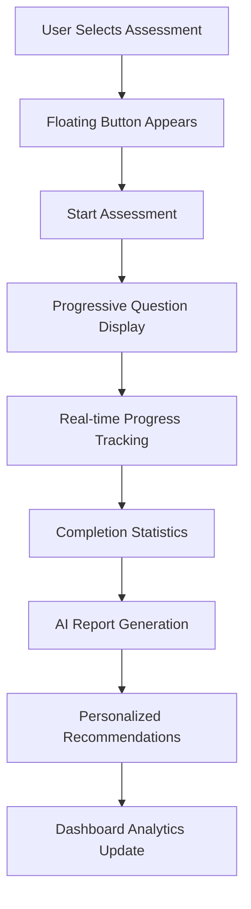

# Solution Architecture - Psychological Journey App v1.1.0

## 🏗️ Architecture Overview

The Psychological Journey application is a modern, client-side React application built with Next.js 14 that provides AI-powered psychological assessments. The architecture emphasizes privacy, performance, and user experience while maintaining robust error handling and scalability.

## 📋 Table of Contents

- [System Architecture](#system-architecture)
- [Core Components](#core-components)
- [Data Flow](#data-flow)
- [State Management](#state-management)
- [Error Handling Strategy](#error-handling-strategy)
- [Performance Optimizations](#performance-optimizations)
- [Security & Privacy](#security--privacy)
- [Deployment Architecture](#deployment-architecture)
- [Scalability Considerations](#scalability-considerations)

## 🏛️ System Architecture

### High-Level Architecture

```
┌─────────────────────────────────────────────────────────────┐
│                    User Interface Layer                     │
├─────────────────────────────────────────────────────────────┤
│  Next.js 14 App Router │ Framer Motion │ TailwindCSS        │
├─────────────────────────────────────────────────────────────┤
│                   Business Logic Layer                      │
├─────────────────────────────────────────────────────────────┤
│  Assessment Engine │ Therapy Engine │ Report Generator     │
├─────────────────────────────────────────────────────────────┤
│                    Data Layer                              │
├─────────────────────────────────────────────────────────────┤
│  Local Storage │ Session Storage │ Browser Cache            │
├─────────────────────────────────────────────────────────────┤
│                   External Services                        │
├─────────────────────────────────────────────────────────────┤
│             Google Gemini AI API (v2.0-flash)              │
└─────────────────────────────────────────────────────────────┘
```

### Technology Stack

| Layer | Technology | Purpose |
|-------|------------|---------|
| **Frontend Framework** | Next.js 14 (App Router) | React-based framework with SSR/SSG capabilities |
| **Language** | TypeScript | Type-safe development and enhanced DX |
| **Styling** | TailwindCSS | Utility-first CSS framework |
| **Animations** | Framer Motion | Advanced animations and interactions |
| **Icons** | Lucide React | Consistent, customizable icon library |
| **State Management** | React Hooks | Local state with localStorage persistence |
| **AI Integration** | Google Gemini API | AI-powered report generation |
| **Storage** | Browser APIs | Local/Session storage for privacy |

## 🧩 Core Components

### 1. Navigation & Routing

#### Floating Navigation System
```typescript
// Adaptive floating button that appears based on user selection
<FloatingBeginJourney 
  selectedAssessment={selectedAssessment}
  onStart={startJourney}
  responsive={true}
/>
```

**Features:**
- Always visible when assessment is selected
- Responsive design for mobile/desktop
- Smooth animations with spring physics
- Quick assessment switching capability

#### App Router Structure
```
src/app/
├── page.tsx                    # Landing page with assessment selection
├── dashboard/
│   ├── page.tsx               # Analytics and reports dashboard
│   ├── error.tsx              # Error boundary component
│   └── loading.tsx            # Loading state component
├── assessment/[type]/
│   └── page.tsx               # Dynamic assessment pages (28 types)
├── report/[assessmentId]/
│   └── page.tsx               # Individual report viewing
└── therapy/
    └── page.tsx               # Therapy center (in development)
```

### 2. Assessment Engine

#### Assessment Types (28 Categories)

| Category | Assessment Types | Focus Area |
|----------|------------------|------------|
| **CBT** | anxiety, ocd, behavioral-activation, habit-reversal, problem-solving | Cognitive Behavioral Therapy |
| **Mindfulness** | mindfulness, acceptance-commitment, mindful-cognitive | Present-moment awareness |
| **Emotional** | anger, emotion-regulation, interpersonal | Emotion management |
| **Compassion** | self-compassion, positive-psychology, strengths | Self-kindness |
| **Lifestyle** | sleep, relaxation, breathing, exercise, nutrition | Holistic wellness |
| **Specialized** | trauma, schema, narrative, motivation, solution-focused | Advanced therapies |
| **General** | general | Overall wellbeing |

#### Question System Architecture
```typescript
interface Question {
  id: string;
  type: 'mcq' | 'scale' | 'open-ended';
  text: string;
  environment: 'ocean' | 'forest' | 'mountains' | 'garden' | 'space';
  options?: string[];
  scaleRange?: [number, number];
  therapyMapping: string[];
  // Advanced analysis fields
  cognitivePattern?: string;
  emotionalPattern?: string;
  behavioralPattern?: string;
  severityIndicator?: 'low' | 'moderate' | 'high';
}
```

### 3. Dashboard Architecture

#### Analytics Engine
```typescript
interface AnalyticsData {
  totalAssessments: number;
  totalTimeSpent: number;              // Never shows "N/A"
  averageSessionTime: number;
  completionRate: number;
  totalReports: number;
  averageReportGenTime: number;        // Precise AI timing
  thisMonthAssessments: number;
  improvementTrend: 'improving' | 'stable' | 'declining';
  typeDistribution: Partial<Record<AssessmentType, number>>;
}
```

#### Error Handling Architecture
```typescript
// Dashboard Error Boundary
export default function DashboardError({ error, reset }: ErrorPageProps) {
  // Comprehensive error recovery with user-friendly messaging
  // Automatic retry mechanisms
  // Graceful degradation to empty states
}

// Loading States
export default function DashboardLoading() {
  // Skeleton UI with realistic content placeholders
  // Progressive loading indicators
  // Accessibility compliant loading states
}
```

### 4. AI Integration Layer

#### Gemini AI Service Architecture
```typescript
class GeminiService {
  // Performance tracking with precise timing
  async generateReport(assessment: Assessment): Promise<AssessmentReport> {
    const startTime = performance.now();
    
    // Process assessment data
    const report = await this.processWithAI(assessment);
    
    // Add precise timing metadata
    return {
      ...report,
      generationTimeMs: Math.round(performance.now() - startTime),
      processingStartedAt: new Date(),
      processingCompletedAt: new Date()
    };
  }
}
```

#### Recommendation Engine
```typescript
interface TherapyRecommendation {
  therapyType: AssessmentType;
  priority: 'primary' | 'secondary' | 'supplementary';
  confidence: number;
  reasoning: string[];
  suggestedExercises: string[];
  estimatedDuration: string;
  successPredictors: string[];
  potentialBarriers: string[];
  evidenceLevel: 'high' | 'moderate' | 'emerging';
}
```

## 🔄 Data Flow

### Assessment Flow


### State Management Flow
```typescript
// Assessment State Management
const [assessment, setAssessment] = useState<Assessment>({
  id: generateId(),
  type: assessmentType,
  questions: getQuestionsForAssessment(assessmentType),
  responses: [],
  currentQuestionIndex: 0,
  isCompleted: false,
  startedAt: new Date(),
  skippedQuestions: []
});

// Persistent Storage
useEffect(() => {
  StorageService.saveCurrentAssessment(assessment);
}, [assessment]);
```

### Error Recovery Flow
```typescript
// Multi-layer error handling
const loadDashboardData = async () => {
  // 1. Client-side check
  if (typeof window === 'undefined') return;
  
  try {
    // 2. Storage operation with fallback
    const assessments = StorageService.getAssessments();
  } catch (storageError) {
    // 3. Graceful degradation
    console.warn('Storage unavailable:', storageError);
    setData({ assessments: [], reports: [] });
  } finally {
    // 4. Always resolve loading state
    setLoading(false);
  }
};
```

## 💾 State Management

### Local State Architecture
- **React Hooks**: Primary state management for UI components
- **Context-free Design**: Eliminates prop drilling with component composition
- **Persistent Storage**: Automatic sync with localStorage for data persistence

### Storage Strategy
```typescript
export class StorageService {
  // Assessment persistence with date handling
  static saveAssessment(assessment: Assessment): void {
    // Automatic date serialization/deserialization
    // Error recovery for corrupted data
    // Privacy-first storage approach
  }
  
  // Secure API key management
  static saveGeminiApiKey(apiKey: string): void {
    // Session storage for security
    // Automatic expiration (1 hour)
    // Secure cookie backup
  }
}
```

### Data Refresh Mechanisms
```typescript
// Automatic refresh on tab focus
useEffect(() => {
  const handleFocus = () => loadDashboardData();
  const handleVisibilityChange = () => {
    if (!document.hidden) loadDashboardData();
  };
  
  window.addEventListener('focus', handleFocus);
  document.addEventListener('visibilitychange', handleVisibilityChange);
  
  return cleanup;
}, []);
```

## 🛡️ Error Handling Strategy

### Multi-Layer Error Boundaries

#### 1. Route-Level Error Boundaries
```typescript
// src/app/dashboard/error.tsx
export default function DashboardError({ error, reset }) {
  // User-friendly error messages
  // Automatic retry mechanisms
  // Fallback navigation options
}
```

#### 2. Component-Level Error Handling
```typescript
// Defensive programming for external data
const renderRecommendationCard = (recommendation: any) => {
  if (!recommendation?.therapyType) {
    console.warn('Invalid recommendation:', recommendation);
    return null;
  }
  // Render with fallback values
};
```

#### 3. Service-Level Error Recovery
```typescript
// AI service with comprehensive error handling
try {
  const result = await model.generateContent(prompt);
  return this.parseAIResponse(result);
} catch (error) {
  // Fallback to predefined recommendations
  return this.getFallbackRecommendations(assessmentType);
}
```

### Loading State Management
- **Initial Loading**: Skeleton UI with realistic placeholders
- **Progressive Loading**: Phased content appearance
- **Error States**: Clear error messages with recovery actions
- **Empty States**: Engaging empty states with clear next steps

## ⚡ Performance Optimizations

### Frontend Optimizations

#### 1. Animation Performance
```typescript
// GPU-accelerated animations
<motion.div
  animate={{ opacity: 1, y: 0 }}
  transition={{ type: 'spring', stiffness: 400, damping: 25 }}
  // Force GPU acceleration
  style={{ transform: 'translateZ(0)' }}
>
```

#### 2. Bundle Optimization
- **Dynamic Imports**: Code splitting for assessment types
- **Tree Shaking**: Eliminates unused code
- **Icon Optimization**: Selective icon imports from Lucide React

#### 3. Rendering Performance
```typescript
// Memoized analytics calculations
const analytics = useMemo<AnalyticsData>(() => {
  return calculateAnalytics(data);
}, [data]);

// Optimized filtering and sorting
const applyFiltersAndSorting = useCallback(() => {
  // Efficient data processing
}, [data, activeFilter, sortBy]);
```

### Storage Performance
- **Efficient Serialization**: Optimized JSON storage
- **Lazy Loading**: On-demand data loading
- **Cache Management**: Automatic cleanup of old data

## 🔒 Security & Privacy

### Privacy-First Architecture
- **No Server Storage**: All data remains on user's device
- **Local Processing**: Assessment data never leaves the browser
- **API Key Security**: Session-based storage with automatic expiration

### Data Protection
```typescript
// Secure API key management
static saveGeminiApiKey(apiKey: string): void {
  sessionStorage.setItem(STORAGE_KEYS.GEMINI_API_KEY, apiKey);
  Cookies.set(STORAGE_KEYS.GEMINI_API_KEY, apiKey, { 
    secure: true, 
    sameSite: 'strict',
    expires: 1/24 // 1 hour
  });
}
```

### Content Security
- **Input Sanitization**: All user inputs sanitized before AI processing
- **Output Validation**: AI responses validated before display
- **Error Masking**: Sensitive error details hidden from users

## 🚀 Deployment Architecture

### Build Configuration
```typescript
// next.config.js
const nextConfig = {
  output: 'standalone',
  trailingSlash: false,
  reactStrictMode: true,
  swcMinify: true,
  experimental: {
    typedRoutes: true
  }
};
```

### Environment Strategy
- **Development**: Hot reload with comprehensive error reporting
- **Production**: Optimized builds with error boundaries
- **Staging**: Production-like environment for testing

### Performance Monitoring
```typescript
// Built-in performance tracking
const generationTimeMs = Math.round(performance.now() - startTime);

// Analytics for optimization
console.log('Dashboard data refreshed:', {
  assessments: assessments.length,
  reports: reports.length,
  timestamp: new Date().toISOString()
});
```

## 📈 Scalability Considerations

### Current Limitations
- **Client-Side Storage**: Limited by browser storage quotas
- **Single-User Focus**: Designed for individual use
- **API Rate Limits**: Dependent on Gemini API quotas

### Future Scalability Options

#### 1. Backend Integration
```typescript
// Future: Optional backend sync
interface SyncService {
  syncToCloud(userData: UserData): Promise<void>;
  syncFromCloud(): Promise<UserData>;
  enableOfflineMode(): void;
}
```

#### 2. Multi-User Support
- **User Profiles**: Multiple user support with data isolation
- **Sharing Features**: Optional report sharing with privacy controls
- **Collaborative Features**: Family or therapist access (opt-in)

#### 3. Enhanced AI Features
- **Model Customization**: Specialized models for different assessment types
- **Continuous Learning**: Improved recommendations based on anonymized patterns
- **Multi-Modal AI**: Integration of voice and image analysis

### Performance Scaling
- **CDN Integration**: Static asset distribution
- **Progressive Web App**: Offline capability and native-like experience
- **Background Processing**: Service worker for heavy computations

## 🧪 Testing Architecture

### Testing Strategy
- **Unit Tests**: Component and utility function testing
- **Integration Tests**: User flow and API integration testing
- **E2E Tests**: Complete user journey validation
- **Performance Tests**: Load and stress testing

### Quality Assurance
- **TypeScript**: Compile-time error prevention
- **ESLint**: Code quality and consistency
- **Accessibility**: WCAG 2.1 AA compliance
- **Browser Testing**: Cross-browser compatibility

## 📊 Monitoring & Analytics

### Application Monitoring
```typescript
// Performance monitoring
const startTime = performance.now();
// ... operation
const duration = performance.now() - startTime;
console.log(`Operation completed in ${duration}ms`);
```

### User Experience Metrics
- **Assessment Completion Rates**: Track user engagement
- **Time to Report Generation**: Monitor AI performance
- **Error Rates**: Track and improve reliability
- **User Satisfaction**: Implicit feedback through usage patterns

## 🔄 Version History

### v1.1.0 (Current)
- ✨ Floating Begin Journey button with responsive design
- 🛡️ Enhanced dashboard error handling and recovery
- 📱 Improved mobile experience and touch interactions
- 🔧 TypeScript improvements and bug fixes
- ⚡ Performance optimizations and loading states

### v1.0.0 (Previous)
- 🚀 Initial release with core assessment functionality
- 🧠 AI-powered report generation
- 📊 Basic analytics dashboard
- 🎨 Immersive assessment environments

## 🎯 Future Roadmap

### Short Term (v1.2.0)
- **Therapy Center**: Interactive therapy exercises
- **Progress Tracking**: Long-term progress visualization
- **Export Features**: PDF report generation
- **Accessibility**: Enhanced screen reader support

### Medium Term (v2.0.0)
- **Progressive Web App**: Offline capability
- **Advanced Analytics**: Trend analysis and insights
- **Customization**: Personalized themes and preferences
- **Integration**: Mental health app ecosystem connectivity

### Long Term (v3.0.0)
- **AI Assistant**: Conversational therapy companion
- **Multi-Modal**: Voice and gesture-based interactions
- **Predictive Analytics**: Proactive wellness recommendations
- **Clinical Integration**: Healthcare provider collaboration tools

---

## 📝 Conclusion

The Psychological Journey application represents a modern, privacy-focused approach to digital mental health assessment. The architecture balances user experience, performance, and privacy while maintaining the flexibility to evolve with user needs and technological advances.

The current v1.1.0 release establishes a solid foundation with robust error handling, responsive design, and comprehensive assessment capabilities. The modular architecture ensures that future enhancements can be integrated seamlessly while maintaining the core principles of privacy, accessibility, and user empowerment.

**Key Architectural Strengths:**
- Privacy-first design with local data storage
- Comprehensive error handling and recovery
- Responsive, accessible user interface
- Scalable component architecture
- Performance-optimized with modern web standards
- Extensible AI integration layer

This architecture documentation serves as a living document that will evolve with the application, ensuring that development decisions remain aligned with the core mission of providing safe, effective, and empowering mental health tools.
