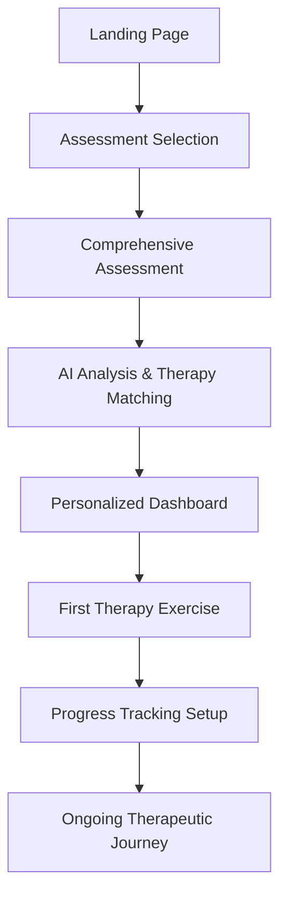

# 🌟 **Comprehensive Therapy Catalog & Digital Implementation Guide**

*Evidence-Based Mental Health Interventions for Self-Assessment Journey Platform*

---

## 📋 **Table of Contents**

1. [Overview & Philosophy](#overview--philosophy)
2. [CBT Family Therapies](#-1-cognitive--behavioral-therapies-cbt-family)
3. [Mindfulness & Acceptance Therapies](#-2-mindfulness--acceptance-therapies)
4. [Emotion Regulation & Interpersonal Therapies](#-3-emotion-regulation--interpersonal-therapies)
5. [Compassion & Self-Kindness Therapies](#-4-compassion--self-kindness-therapies)
6. [Lifestyle & Holistic Approaches](#-5-lifestyle--holistic-approaches)
7. [Specialized Therapies](#-6-specialized-therapies-advanced-modules)
8. [Digital Exercise Library](#-digital-exercise-library)
9. [Assessment Integration](#-assessment-integration)
10. [Technical Implementation](#-technical-implementation)
11. [User Journey Mapping](#-user-journey-mapping)
12. [Progress Tracking & Analytics](#-progress-tracking--analytics)

---

## 🎯 **Overview & Philosophy**

### Core Principles

- **Evidence-Based**: All therapies grounded in peer-reviewed research
- **Self-Guided**: Designed for autonomous learning and practice
- **Progressive**: Start simple, build complexity over time
- **Personalized**: AI-driven recommendations based on assessment patterns
- **Engaging**: Gamified elements without trivializing mental health
- **Safe**: Clear boundaries, crisis resources, professional referral pathways

### Digital Adaptation Strategy

1. **Micro-Learning**: Break complex concepts into digestible 2-3 minute modules
2. **Interactive Elements**: Replace passive reading with hands-on exercises
3. **Immediate Feedback**: Real-time validation and encouragement
4. **Spaced Repetition**: Return to key concepts across multiple sessions
5. **Multi-Modal**: Text, audio, visual, and kinesthetic learning options

---

## 🧠 **1. Cognitive & Behavioral Therapies (CBT Family)**

### **1.1 Cognitive Behavioral Therapy (CBT)**

**Core Concept**: Thoughts, feelings, and behaviors are interconnected. Change negative thought patterns to improve emotions and actions.

**Evidence Base**: 
- Over 500 RCTs supporting efficacy
- First-line treatment for anxiety, depression, OCD
- Effect sizes: d = 0.68-0.84 for anxiety disorders

**Digital Implementation**:

#### **Assessment Questions**:
```javascript
{
  id: 'cbt_thought_patterns',
  type: 'mcq',
  question: 'How often do you catch yourself thinking "What if something terrible happens?"',
  options: ['Never', 'Rarely', 'Sometimes', 'Often', 'Almost constantly'],
  cognitiveDistortions: ['catastrophizing', 'fortune_telling'],
  severity_mapping: {
    'Almost constantly': 'high',
    'Often': 'moderate',
    'Sometimes': 'mild'
  }
}
```

#### **Digital Exercises**:

**Thought Record Builder**:
- **Trigger**: Interactive timeline to identify when negative thoughts occur
- **Interface**: Speech-to-text or guided writing prompts
- **Analysis**: AI identifies cognitive distortions (catastrophizing, all-or-nothing thinking)
- **Reframing**: Suggested alternative thoughts with user customization
- **Progress**: Visual trend of thought pattern changes over time

**Cognitive Distortion Detective**:
- **Gamified**: Points for identifying distortions in scenario cards
- **Learning**: Interactive examples with immediate feedback
- **Practice**: Daily "distortion spotting" challenges
- **Social**: Anonymous sharing of reframed thoughts (with consent)

**Behavioral Experiment Planner**:
- **Hypothesis**: "If I go to the party, everyone will judge me"
- **Experiment**: Attend for 30 minutes, track actual responses
- **Data Collection**: Real-time mood/anxiety tracking via phone
- **Analysis**: Compare predictions vs. reality
- **Integration**: Build behavioral experiment library

#### **Progress Metrics**:
- Frequency of thought record completion
- Reduction in cognitive distortion identification
- Behavioral experiment completion rate
- Self-reported mood improvements
- Time between trigger and rational response

---

### **1.2 Exposure and Response Prevention (ERP)**

**Core Concept**: Gradual, systematic exposure to feared situations while preventing compulsive responses.

**Evidence Base**:
- Gold standard for OCD treatment
- 60-85% response rate in clinical trials
- Long-term efficacy maintenance

**Digital Implementation**:

#### **Assessment Questions**:
```javascript
{
  id: 'erp_compulsion_mapping',
  type: 'hierarchical',
  question: 'Rate your anxiety level for each situation (0-100)',
  scenarios: [
    'Touching a doorknob without washing hands',
    'Leaving house without checking locks',
    'Having an intrusive thought without neutralizing'
  ],
  compulsion_tracking: true,
  avoidance_patterns: true
}
```

#### **Digital Exercises**:

**Exposure Hierarchy Builder**:
- **Setup**: Drag-and-drop interface for ranking fears (0-100 anxiety scale)
- **Progression**: Start with 30-40 anxiety level exposures
- **Timer**: Built-in exposure duration tracking
- **Support**: Breathing exercises during exposures
- **Analytics**: Habituation curves showing anxiety reduction over time

**Virtual Reality Exposures**:
- **Contamination**: Virtual public spaces, door handles, surfaces
- **Checking**: Virtual home environment for lock/appliance checking
- **Symmetry**: Interactive organization tasks with tolerance building
- **Harm OCD**: Safe virtual scenarios for intrusive thought exposure

**Response Prevention Toolkit**:
- **Urge Surfing**: Real-time graphs showing compulsion urges rising and falling
- **Delay Timer**: Graduated delays (5min → 15min → 1hr → 24hr)
- **Alternative Actions**: Suggested competing behaviors
- **Support Network**: Quick access to encouragement from support system

#### **Progress Metrics**:
- Subjective Units of Distress (SUDS) reduction per exposure
- Duration of exposure tolerance
- Compulsion frequency tracking
- Habituation rate calculations
- Quality of life improvements

---

### **1.3 Behavioral Activation (BA)**

**Core Concept**: Depression and anxiety are maintained by avoidance behaviors. Scheduling meaningful activities improves mood and motivation.

**Evidence Base**:
- Comparable efficacy to CBT for depression
- Particularly effective for anhedonia and low motivation
- Strong evidence for anxiety with comorbid depression

**Digital Implementation**:

#### **Assessment Questions**:
```javascript
{
  id: 'ba_activity_patterns',
  type: 'activity_tracking',
  question: 'How has your engagement in these activities changed?',
  activities: [
    'Social interactions',
    'Physical exercise',
    'Creative pursuits',
    'Work/productivity',
    'Self-care'
  ],
  time_periods: ['past_week', 'past_month', 'past_3_months'],
  mood_correlation: true
}
```

#### **Digital Exercises**:

**Activity Scheduler Pro**:
- **Values Assessment**: Identify personal values and meaningful activities
- **Activity Bank**: Curated database of 500+ activities by category
- **Smart Scheduling**: AI suggests optimal timing based on energy patterns
- **Mood Prediction**: Forecast mood impact of different activities
- **Social Integration**: Connect with others for joint activities

**Avoidance Pattern Tracker**:
- **Trigger Identification**: What situations lead to avoidance?
- **Cost-Benefit Analysis**: Interactive tools showing costs of avoidance
- **Graded Task Assignment**: Break overwhelming tasks into steps
- **Accountability Features**: Share goals with support person
- **Celebration System**: Reward completion with positive reinforcement

**Mood-Activity Correlation Engine**:
- **Data Collection**: Daily mood and activity logging
- **Pattern Recognition**: AI identifies mood-boosting activities
- **Personalized Recommendations**: Suggest activities based on current mood
- **Trend Analysis**: Long-term patterns and seasonal variations
- **Optimization**: Continuously refine activity suggestions

---

### **1.4 Habit Reversal Training (HRT)**

**Core Concept**: Replace unwanted habits/tics with competing responses through awareness and alternative behaviors.

**Evidence Base**:
- 80% reduction in tic frequency in clinical trials
- Effective for hair pulling, nail biting, skin picking
- Durable long-term outcomes

**Digital Implementation**:

#### **Digital Exercises**:

**Habit Loop Detector**:
- **Real-time Monitoring**: Smartwatch integration for movement detection
- **Pattern Analysis**: Identify triggers, locations, times for habits
- **Predictive Alerts**: Warn user when habit likely to occur
- **Environmental Mapping**: GPS correlation with habit frequency
- **Social Triggers**: Track habit occurrence around different people

**Competing Response Library**:
- **Personalized Alternatives**: Custom competing responses for each habit
- **Training Modules**: Practice sessions for competing responses
- **Intensity Matching**: Alternative behaviors match habit intensity
- **Duration Training**: Build endurance for competing responses
- **Habit Substitution**: Replace negative habits with positive ones

---

### **1.5 Problem-Solving Therapy (PST)**

**Core Concept**: Systematic approach to identifying problems and generating effective solutions.

**Digital Implementation**:

**5-Step Problem Solver**:
1. **Problem Definition**: Structured prompts to clarify issues
2. **Goal Setting**: SMART goals framework with progress tracking
3. **Solution Generation**: Brainstorming tools with AI suggestions
4. **Decision Making**: Pros/cons analysis with weighted criteria
5. **Implementation**: Action planning with accountability features

---

## 🌱 **2. Mindfulness & Acceptance Therapies**

### **2.1 Mindfulness-Based Stress Reduction (MBSR)**

**Core Concept**: Develop moment-to-moment awareness to reduce reactivity to stress and difficult emotions.

**Evidence Base**:
- Meta-analyses show moderate to large effect sizes (d = 0.68)
- Effective for anxiety, depression, chronic pain
- Neuroplasticity changes in brain structure

**Digital Implementation**:

#### **Assessment Questions**:
```javascript
{
  id: 'mbsr_mindfulness_assessment',
  type: 'scale',
  question: 'I find myself doing things without paying attention',
  scale: {
    min: 1,
    max: 7,
    labels: ['Never', 'Almost Never', 'Rarely', 'Sometimes', 'Often', 'Almost Always', 'Always']
  },
  mindfulness_domain: 'present_moment_awareness',
  reverse_scored: true
}
```

#### **Digital Exercises**:

**Guided Meditation Library**:
- **Progressive Difficulty**: 2min → 5min → 10min → 20min sessions
- **Variety**: Body scan, breathing, loving-kindness, walking meditation
- **Biometric Integration**: Heart rate variability feedback
- **Environment Sync**: Adapt to user's location/weather
- **Streak Tracking**: Meditation consistency rewards

**Mindful Moments Micro-Practices**:
- **Bell Reminders**: Random mindfulness prompts throughout day
- **Sensory Anchoring**: "5-4-3-2-1" grounding exercises
- **Breathing Pacer**: Visual/audio breathing rhythm guides
- **Mindful Eating**: Photo-based mindful meal tracking
- **Walking Meditation**: GPS-guided mindful walking routes

**Stress Response Monitor**:
- **Real-time Tracking**: Continuous stress level monitoring
- **Trigger Identification**: Correlate stress spikes with activities
- **Intervention Timing**: Optimal moments for mindfulness practice
- **Recovery Tracking**: How quickly stress levels normalize
- **Long-term Trends**: Stress resilience improvements over time

---

### **2.2 Acceptance and Commitment Therapy (ACT)**

**Core Concept**: Accept difficult thoughts/feelings while committing to actions aligned with personal values.

**Evidence Base**:
- Large effect sizes for anxiety and depression
- Particularly effective for experiential avoidance
- Strong evidence for behavioral change maintenance

**Digital Implementation**:

#### **Digital Exercises**:

**Values Clarification Compass**:
- **Interactive Assessment**: Drag-and-drop values ranking
- **Life Domain Mapping**: Career, relationships, health, spirituality
- **Values-Action Alignment**: Track how daily actions match values
- **Decision Framework**: Values-based decision making tools
- **Progress Visualization**: Values living dashboard

**Psychological Flexibility Trainer**:
- **Defusion Exercises**: Interactive thought defusion techniques
- **Leaves on Stream**: Animated visualization for letting go of thoughts
- **Mindful Self-Compassion**: Guided self-kindness practices
- **Acceptance Practice**: Progressive exposure to difficult emotions
- **Committed Action**: Value-based goal setting and tracking

---

### **2.3 Mindfulness-Based Cognitive Therapy (MBCT)**

**Core Concept**: Combine mindfulness with cognitive therapy to prevent depression relapse.

**Digital Implementation**:

**Thought Observation Deck**:
- **Thought Labeling**: Categorize thoughts without judgment
- **Rumination Detection**: AI identifies repetitive thought patterns
- **Decentering Practice**: Step back from thoughts as observer
- **Mood Episode Prevention**: Early warning system for mood changes
- **Relapse Prevention**: Personalized strategies based on patterns

---

## 🔥 **3. Emotion Regulation & Interpersonal Therapies**

### **3.1 Dialectical Behavior Therapy (DBT)**

**Core Concept**: Balance acceptance and change through distress tolerance, emotion regulation, interpersonal effectiveness, and mindfulness.

**Evidence Base**:
- Highly effective for borderline personality disorder
- Strong evidence for emotion regulation difficulties
- Reduces self-harm and suicidal behaviors

**Digital Implementation**:

#### **Digital Exercises**:

**STOP Skill Simulator**:
- **Stop**: Immediate pause button when overwhelmed
- **Take a Step Back**: Breathing space timer with guided prompts
- **Observe**: Emotion labeling with intensity tracking
- **Proceed**: Value-based action selection from menu
- **Practice Scenarios**: Simulated difficult situations

**Distress Tolerance Toolkit**:
- **TIPP Skills**: Temperature change, Intense exercise, Paced breathing, Paired muscle relaxation
- **Distraction Techniques**: Interactive games, puzzles, creative activities
- **Self-Soothing Kit**: Personalized sensory tools (music, images, textures)
- **Crisis Survival**: Immediate coping strategies for acute distress
- **Urge Surfing**: Real-time urge intensity tracking with coping prompts

**Emotion Regulation Dashboard**:
- **Emotion Thermometer**: Track emotional intensity throughout day
- **Trigger Pattern Analysis**: Identify what sparks emotional reactions
- **Opposite Action Coach**: Suggestions for acting opposite to emotion urges
- **Mastery Activities**: Build positive emotions through achievement
- **PLEASE Skills**: Treating physical illness, balance eating, avoiding mood-altering substances, balanced sleep, get exercise

**Interpersonal Effectiveness Trainer**:
- **DEAR MAN**: Request/boundary setting communication framework
- **Role-Play Scenarios**: Practice difficult conversations safely
- **Relationship Mapping**: Track relationship quality and interactions
- **Conflict Resolution**: Guided problem-solving for relationship issues
- **Assertiveness Building**: Progressive assertiveness skill development

---

### **3.2 Anger Management Therapy**

**Core Concept**: Identify triggers, develop coping strategies, and learn alternative responses to anger.

**Digital Implementation**:

**Anger Diary Plus**:
- **Trigger Tracking**: Voice-to-text anger incident logging
- **Intensity Scaling**: 0-10 anger levels with physiological markers
- **Pattern Recognition**: Time, location, people, situation analysis
- **Warning Signs**: Early anger cues identification
- **Recovery Tracking**: How long to return to baseline

**Cognitive Reframing Workshop**:
- **Anger Thoughts**: Common anger-inducing thought patterns
- **Alternative Perspectives**: Interactive reframing exercises
- **Empathy Building**: Consider others' perspectives in conflicts
- **Problem vs. Person**: Separate issues from personal attacks
- **Realistic Expectations**: Adjust unrealistic standards that fuel anger

**Relaxation Response Trainer**:
- **Progressive Muscle Relaxation**: Guided tension-release exercises
- **Breathing Techniques**: 4-7-8 breathing with visual guides
- **Visualization**: Calming scene imagery with personalization
- **Quick Techniques**: 30-second emergency anger management
- **Biofeedback**: Real-time stress response monitoring

---

### **3.3 Interpersonal Therapy (IPT)**

**Core Concept**: Improve relationships and communication to reduce emotional distress.

**Digital Implementation**:

**Relationship Quality Tracker**:
- **Satisfaction Ratings**: Regular relationship quality assessments
- **Communication Patterns**: Track positive vs. negative interactions
- **Conflict Resolution**: Document and analyze disagreement patterns
- **Support Network**: Map and strengthen social connections
- **Intimacy Building**: Exercises for deeper emotional connection

**Communication Skills Lab**:
- **Active Listening**: Interactive listening skill practice
- **Empathy Training**: Perspective-taking exercises
- **Assertiveness Without Aggression**: Balanced communication techniques
- **Boundary Setting**: Healthy limit-setting strategies
- **Conflict De-escalation**: Step-by-step conflict resolution tools

---

## 💙 **4. Compassion & Self-Kindness Therapies**

### **4.1 Compassion-Focused Therapy (CFT)**

**Core Concept**: Develop self-compassion to counteract shame and self-criticism.

**Evidence Base**:
- Effective for high shame and self-criticism
- Improves emotional regulation
- Reduces depression and anxiety symptoms

**Digital Implementation**:

**Self-Compassion Letter Studio**:
- **Guided Writing**: Prompts for writing self-compassionate letters
- **Voice Recording**: Option to record compassionate self-talk
- **Template Library**: Various self-compassion frameworks
- **Sharing Option**: Anonymous sharing for mutual support
- **Progress Tracking**: Self-compassion scale improvements

**Compassionate Mind Trainer**:
- **Three Systems Model**: Threat, drive, and soothing system education
- **Soothing Rhythm Breathing**: Guided breathing for self-regulation
- **Compassionate Imagery**: Visualization of compassionate figures
- **Self-Criticism Detector**: Identify and counter self-critical thoughts
- **Loving-Kindness Meditation**: Progressive compassion practices

---

### **4.2 Positive Psychology Interventions (PPI)**

**Core Concept**: Focus on strengths, gratitude, and positive emotions to build resilience.

**Digital Implementation**:

**Gratitude Journal 2.0**:
- **Three Good Things**: Daily recording with emotion tracking
- **Gratitude Photos**: Visual gratitude with explanation prompts
- **Letter Writing**: Gratitude letters to important people
- **Savoring Diary**: Enhance positive experiences through reflection
- **Appreciation Alerts**: Random prompts to notice good things

**Strengths Discovery Engine**:
- **VIA Character Strengths**: Integrated assessment and application
- **Strengths Spotting**: Daily exercises to use top strengths
- **Strengths in Relationships**: Apply strengths to improve connections
- **Career Alignment**: Match strengths with professional goals
- **Challenge Reframing**: Use strengths to overcome difficulties

**Positive Emotion Cultivator**:
- **Joy Practice**: Activities scientifically proven to increase joy
- **Hope Building**: Goal-setting and pathway thinking exercises
- **Pride Cultivation**: Acknowledge personal achievements
- **Love Expression**: Exercises to express and receive love
- **Awe Experiences**: Curated awe-inspiring content and activities

---

## 🌙 **5. Lifestyle & Holistic Approaches**

### **5.1 Sleep Hygiene Therapy**

**Core Concept**: Optimize sleep environment and behaviors for better mental health.

**Digital Implementation**:

**Sleep Optimization Center**:
- **Sleep Diary**: Detailed sleep pattern tracking with mood correlation
- **Environment Audit**: Bedroom optimization recommendations
- **Routine Builder**: Personalized bedtime routine creation
- **Sleep Restriction**: Therapeutic sleep window management
- **Smart Alarm**: Wake during optimal sleep cycle phase

**Bedtime Routine Designer**:
- **Activity Library**: Sleep-promoting pre-sleep activities
- **Digital Sunset**: Blue light reduction reminders and tools
- **Relaxation Sequences**: Progressive relaxation for sleep onset
- **Worry Time**: Scheduled worry period to clear mind before bed
- **Sleep Stories**: Guided narratives designed to promote sleep

---

### **5.2 Relaxation Training**

**Core Concept**: Systematic training in relaxation techniques to reduce stress and anxiety.

**Digital Implementation**:

**Progressive Muscle Relaxation (PMR) Guide**:
- **Interactive Body Map**: Click muscle groups for targeted relaxation
- **Audio Instructions**: Guided PMR sessions of varying lengths
- **Tension Recognition**: Learn to identify muscle tension patterns
- **Quick Release**: Rapid relaxation techniques for acute stress
- **Progress Tracking**: Relaxation skill development over time

**Guided Imagery Theater**:
- **Scene Selection**: Choose from library of calming environments
- **Personalization**: Customize imagery based on preferences
- **Multi-Sensory**: Incorporate sounds, scents, and textures
- **Stress-Specific**: Different imagery for different stressors
- **Creation Tools**: Build personal guided imagery sessions

---

### **5.3 Breathing Techniques**

**Core Concept**: Use breath control to regulate the nervous system and reduce anxiety.

**Digital Implementation**:

**Breathing Pacer Academy**:
- **Technique Library**: Box breathing, 4-7-8, coherent breathing
- **Visual Guides**: Animated breathing patterns for pacing
- **Biometric Feedback**: Heart rate variability monitoring
- **Stress Response**: Immediate breathing intervention for stress spikes
- **Skill Building**: Progressive breathing technique complexity

**Breath Awareness Builder**:
- **Mindful Breathing**: Attention training through breath focus
- **Pattern Recognition**: Identify breathing patterns in different emotions
- **Natural Rhythm**: Find and enhance personal optimal breathing rate
- **Integration**: Breathing awareness during daily activities
- **Calming Signals**: Use breath as anchor during difficult emotions

---

### **5.4 Exercise & Movement Therapy**

**Core Concept**: Physical activity as intervention for mental health improvement.

**Digital Implementation**:

**Movement for Mood Program**:
- **Activity Prescription**: Personalized exercise recommendations
- **Mood Tracking**: Before/after exercise mood assessments
- **Gentle Movement**: Low-impact options for depression/anxiety
- **Nature Integration**: Outdoor exercise promotion and tracking
- **Social Movement**: Group exercise opportunities and challenges

**Mind-Body Connection Explorer**:
- **Body Awareness**: Tune into physical sensations during movement
- **Emotional Release**: Movement practices for emotional expression
- **Stress Discharge**: High-intensity interval training for stress relief
- **Embodiment Practice**: Connect with body through mindful movement
- **Energy Management**: Match exercise intensity to energy levels

---

### **5.5 Nutrition & Mind-Body Wellness**

**Core Concept**: Understand food-mood connections and develop healthy eating patterns.

**Digital Implementation**:

**Food-Mood Journal**:
- **Meal Tracking**: Photo-based food logging with mood correlation
- **Pattern Recognition**: Identify foods that improve/worsen mood
- **Nutritional Education**: Learn about mood-supporting nutrients
- **Meal Planning**: Mental health-focused meal preparation
- **Mindful Eating**: Guided practices for present-moment eating

**Hydration & Energy Tracker**:
- **Water Intake**: Monitor hydration levels and mood correlation
- **Energy Patterns**: Track energy throughout day with eating patterns
- **Blood Sugar Awareness**: Education about blood sugar and mood stability
- **Supplement Tracking**: Monitor vitamin/mineral supplements and mood
- **Gut-Brain Connection**: Educational content and tracking tools

---

## 🌀 **6. Specialized Therapies (Advanced Modules)**

### **6.1 Eye Movement Desensitization & Reprocessing (EMDR)**

**Core Concept**: Process traumatic memories through bilateral stimulation.

**Digital Adaptation**:

**EMDR-Inspired Self-Help**:
- **Bilateral Stimulation**: Audio/visual bilateral cues for self-soothing
- **Resource Installation**: Strengthen positive memories and qualities
- **Safe Place Visualization**: Create and enhance mental safe spaces
- **Grounding Techniques**: Immediate stabilization during flashbacks
- **Trigger Management**: Identify and prepare for trauma triggers

*Note: Full EMDR requires trained therapist; digital version focuses on stabilization and coping skills*

---

### **6.2 Schema Therapy**

**Core Concept**: Identify and heal deep-rooted patterns (schemas) that affect relationships and life choices.

**Digital Implementation**:

**Schema Pattern Detective**:
- **Schema Assessment**: Identify dominant life patterns and themes
- **Early Memory Explorer**: Safe exploration of formative experiences
- **Relationship Pattern Tracker**: Recognize recurring relationship dynamics
- **Reparenting Exercises**: Develop healthy internal parent voice
- **Mode Switching**: Recognize and shift between different emotional modes

**Healing Journey Mapper**:
- **Schema Education**: Learn about different schema types and origins
- **Coping Style Analysis**: Identify surrender, avoidance, or overcompensation patterns
- **Healthy Adult Development**: Strengthen mature, balanced responses
- **Limited Reparenting**: Develop nurturing internal voice
- **Cognitive and Experiential Techniques**: Balanced approach to schema healing

---

### **6.3 Narrative Therapy**

**Core Concept**: Reframe life story to emphasize agency, resilience, and preferred identity.

**Digital Implementation**:

**Life Story Architect**:
- **Story Mapping**: Visual timeline of life experiences and meaning
- **Externalizing Problems**: Separate self from problems through language
- **Unique Outcomes**: Identify times when problems didn't dominate
- **Preferred Identity**: Define and strengthen desired sense of self
- **Audience of Support**: Connect with people who see your preferred story

**Reauthoring Workshop**:
- **Problem Story Deconstruction**: Examine dominant negative narratives
- **Alternative Story Building**: Construct empowering alternative narratives
- **Evidence Gathering**: Collect evidence for preferred story
- **Story Performance**: Share and live into new narrative
- **Meaning Making**: Find significance and purpose in experiences

---

### **6.4 Motivational Interviewing (MI)**

**Core Concept**: Resolve ambivalence and enhance motivation for change.

**Digital Implementation**:

**Change Talk Amplifier**:
- **Ambivalence Exploration**: Safely explore mixed feelings about change
- **Decisional Balance**: Interactive pros/cons analysis with depth
- **Change Talk Recognition**: Identify and strengthen motivation language
- **Confidence Building**: Enhance self-efficacy for change
- **Action Planning**: Transform motivation into concrete steps

**Values-Change Alignment**:
- **Values Clarification**: Deep exploration of personal values
- **Discrepancy Awareness**: Recognize gaps between values and behavior
- **Motivation Enhancement**: Strengthen intrinsic motivation for change
- **Resistance Resolution**: Address barriers to change with compassion
- **Commitment Strengthening**: Support sustained motivation over time

---

### **6.5 Solution-Focused Therapy (SFT)**

**Core Concept**: Focus on solutions and strengths rather than problems and deficits.

**Digital Implementation**:

**Solution Building Toolkit**:
- **Exception Finding**: Identify times when problems were absent/reduced
- **Miracle Question Explorer**: Envision life without current problems
- **Scaling Questions**: Rate progress and identify next steps
- **Goal Clarification**: Define specific, achievable outcomes
- **Progress Amplification**: Recognize and build on small improvements

**Strengths-Based Growth**:
- **Resource Inventory**: Catalog personal strengths, skills, and supports
- **Success Story Archive**: Document and reflect on past successes
- **Small Steps Navigator**: Break goals into manageable actions
- **Progress Celebration**: Acknowledge and celebrate incremental progress
- **Future Focus**: Maintain orientation toward desired outcomes

---

## 💻 **Digital Exercise Library**

### **Interactive Components**

#### **1. Assessment Integration**
```javascript
// Example assessment question with therapy mapping
{
  id: 'anxiety_catastrophizing',
  therapy_mappings: ['cbt', 'act', 'mbsr'],
  question: 'When something unexpected happens, I immediately think of the worst possible outcome',
  type: 'likert_scale',
  cognitive_pattern: 'catastrophizing',
  recommended_exercises: ['thought_record', 'probability_estimation', 'mindful_awareness'],
  severity_threshold: {
    high: 'score >= 4',
    moderate: 'score >= 2',
    low: 'score < 2'
  }
}
```

#### **2. Real-Time Feedback System**
```javascript
// Immediate response to user input
{
  user_response: "I always assume the worst will happen",
  ai_feedback: {
    pattern_recognition: "This suggests catastrophizing - a common thinking pattern that can increase anxiety",
    normalization: "Many people experience this type of thinking, especially during stressful times",
    hope_instillation: "The good news is that thinking patterns can be changed with practice",
    next_steps: "Would you like to try a thought record exercise to explore this pattern?"
  }
}
```

#### **3. Adaptive Difficulty Progression**
```javascript
// Dynamic content adjustment based on user progress
{
  user_skill_level: 'beginner',
  cbt_thought_record: {
    prompts: ['What was the situation?', 'What went through your mind?'],
    guidance_level: 'high',
    examples_provided: true,
    duration: '5_minutes'
  },
  
  user_skill_level: 'advanced',
  cbt_thought_record: {
    prompts: ['Situation', 'Automatic thoughts', 'Emotions', 'Evidence for/against', 'Balanced thought', 'New emotion'],
    guidance_level: 'minimal',
    examples_provided: false,
    duration: '15_minutes'
  }
}
```

### **Gamification Elements**

#### **Achievement System**
- **Streak Tracker**: Consecutive days of practice
- **Skill Badges**: Mastery of specific techniques
- **Progress Milestones**: Significant improvements in assessments
- **Challenge Completion**: Weekly therapeutic challenges
- **Community Recognition**: Peer acknowledgment for progress

#### **Progress Visualization**
- **Skill Trees**: Visual representation of therapy technique mastery
- **Mood Timeline**: Long-term emotional well-being trends
- **Confidence Meter**: Self-efficacy improvements over time
- **Relationship Quality**: Interpersonal skill development
- **Resilience Dashboard**: Overall mental health resilience metrics

---

## 📊 **Assessment Integration**

### **Condition-Therapy Mapping Matrix**

| Assessment Result | Primary Therapies | Secondary Therapies | Digital Exercises |
|------------------|------------------|-------------------|------------------|
| **High Anxiety + Catastrophizing** | CBT, ACT | MBSR, DBT | Thought records, probability estimation, mindfulness |
| **OCD + Compulsions** | ERP, HRT | ACT, CBT | Exposure hierarchy, response prevention, acceptance |
| **Depression + Avoidance** | BA, CBT | ACT, IPT | Activity scheduling, mood tracking, values clarification |
| **Anger + Relationship Issues** | DBT, Anger Management | IPT, CFT | STOP skills, communication training, empathy building |
| **Trauma + Hypervigilance** | EMDR-informed, CFT | MBSR, Grounding | Bilateral stimulation, safe place, grounding techniques |
| **Low Self-Esteem + Criticism** | CFT, CBT | Positive Psychology | Self-compassion letters, strengths identification |
| **Social Anxiety + Avoidance** | CBT, Exposure | ACT, DBT | Social experiments, values-based action, distress tolerance |
| **Sleep Issues + Worry** | Sleep Hygiene, CBT | MBSR, Relaxation | Sleep restriction, worry time, progressive relaxation |

### **Dynamic Recommendation Engine**

```javascript
// AI-powered therapy recommendation system
function generateRecommendations(assessmentResults) {
  const recommendations = {
    primary_therapies: [],
    exercise_sequence: [],
    estimated_timeline: '',
    success_predictors: [],
    potential_barriers: []
  };
  
  // Analyze assessment patterns
  const patterns = identifyPatterns(assessmentResults);
  
  // Match to evidence-based treatments
  const therapyMatches = matchToEvidenceBase(patterns);
  
  // Personalize based on user preferences
  const personalizedPlan = personalizeApproach(therapyMatches, userPreferences);
  
  return personalizedPlan;
}
```

---

## 🔧 **Technical Implementation**

### **Architecture Overview**

#### **Frontend Components**
```typescript
// React component structure for therapy modules
interface TherapyModule {
  id: string;
  name: string;
  category: TherapyCategory;
  evidenceLevel: 'strong' | 'moderate' | 'emerging';
  exercises: Exercise[];
  assessmentIntegration: AssessmentMapping[];
  progressMetrics: ProgressMetric[];
}

interface Exercise {
  id: string;
  name: string;
  type: 'interactive' | 'reflection' | 'behavioral' | 'cognitive';
  duration: number; // minutes
  difficulty: 'beginner' | 'intermediate' | 'advanced';
  requiredInputs: InputField[];
  outputMetrics: string[];
}
```

#### **Backend Services**
```python
# Therapy recommendation engine
class TherapyRecommendationEngine:
    def __init__(self):
        self.evidence_base = load_evidence_database()
        self.user_preferences = UserPreferencesService()
        self.progress_tracker = ProgressTrackingService()
    
    def generate_recommendations(self, assessment_results: dict) -> dict:
        # Pattern recognition
        patterns = self.identify_patterns(assessment_results)
        
        # Evidence-based matching
        therapy_matches = self.match_to_evidence(patterns)
        
        # Personalization
        personalized_plan = self.personalize_approach(
            therapy_matches, 
            self.user_preferences.get_preferences()
        )
        
        return personalized_plan
```

#### **Data Models**
```sql
-- Database schema for comprehensive therapy tracking
CREATE TABLE therapy_sessions (
    id UUID PRIMARY KEY,
    user_id UUID REFERENCES users(id),
    therapy_type VARCHAR(50),
    exercise_id VARCHAR(100),
    session_data JSONB,
    start_time TIMESTAMP,
    end_time TIMESTAMP,
    completion_status VARCHAR(20),
    user_feedback JSONB,
    ai_insights JSONB
);

CREATE TABLE progress_metrics (
    id UUID PRIMARY KEY,
    user_id UUID REFERENCES users(id),
    metric_type VARCHAR(50),
    metric_value DECIMAL,
    measurement_date TIMESTAMP,
    therapy_context VARCHAR(50)
);
```

### **AI Integration Points**

#### **1. Real-Time Therapeutic Response**
- **Natural Language Processing**: Analyze user text responses for emotional content
- **Sentiment Analysis**: Track emotional trajectory throughout exercises
- **Pattern Recognition**: Identify recurring themes and cognitive patterns
- **Adaptive Questioning**: Adjust follow-up questions based on responses
- **Crisis Detection**: Automatically identify high-risk responses

#### **2. Personalized Content Generation**
- **Custom Metaphors**: Generate personally relevant therapeutic metaphors
- **Scenario Creation**: Build practice scenarios based on user's life context
- **Goal Adaptation**: Continuously refine therapeutic goals based on progress
- **Exercise Sequencing**: Optimize order of therapeutic exercises
- **Difficulty Calibration**: Maintain optimal challenge level

#### **3. Progress Prediction and Optimization**
- **Outcome Modeling**: Predict likely therapeutic outcomes based on engagement patterns
- **Intervention Timing**: Identify optimal moments for different interventions
- **Relapse Prevention**: Early warning systems for setbacks
- **Motivation Maintenance**: Strategies to sustain engagement over time
- **Personalization Refinement**: Continuously improve therapeutic matching

---

## 🗺️ **User Journey Mapping**

### **Onboarding Flow**



### **Daily Engagement Pattern**

```typescript
interface DailyJourney {
  morning_checkin: {
    mood_assessment: MoodScale;
    intention_setting: string[];
    recommended_exercises: Exercise[];
  };
  
  afternoon_support: {
    stress_check: boolean;
    quick_interventions: Intervention[];
    progress_encouragement: string;
  };
  
  evening_reflection: {
    practice_completion: boolean;
    insights_gained: string[];
    tomorrow_planning: Goal[];
  };
}
```

### **Long-Term Progression**

**Week 1-2: Foundation**
- Assessment completion and understanding
- Introduction to primary therapy approaches
- Basic skill building and routine establishment
- Goal setting and expectation management

**Week 3-6: Skill Development**
- Regular practice of core techniques
- Gradual difficulty increase
- Pattern recognition and insight development
- Community engagement and support

**Week 7-12: Integration**
- Advanced technique mastery
- Real-world application of skills
- Relapse prevention planning
- Maintenance routine establishment

**3+ Months: Maintenance & Growth**
- Ongoing progress monitoring
- Periodic assessment and plan adjustment
- Peer support and mentoring
- Advanced modules and specializations

---

## 📈 **Progress Tracking & Analytics**

### **Individual Progress Metrics**

#### **Quantitative Measures**
- **Symptom Severity**: Regular standardized assessments (GAD-7, PHQ-9, etc.)
- **Skill Mastery**: Competency ratings for each therapeutic technique
- **Engagement Levels**: Session completion rates, time spent, interaction quality
- **Functional Improvement**: Work, relationships, self-care improvements
- **Resilience Building**: Ability to cope with setbacks and challenges

#### **Qualitative Indicators**
- **Self-Reported Insights**: User reflections on learning and growth
- **Goal Achievement**: Progress toward personally meaningful objectives
- **Quality of Life**: Subjective well-being and life satisfaction
- **Relationship Quality**: Improvements in interpersonal connections
- **Meaning and Purpose**: Sense of direction and life purpose

### **Predictive Analytics**

#### **Success Predictors**
```python
# Machine learning model for predicting therapeutic success
class TherapeuticSuccessPredictor:
    def __init__(self):
        self.features = [
            'initial_engagement_level',
            'session_completion_rate',
            'homework_compliance',
            'social_support_level',
            'baseline_severity',
            'therapy_preference_match',
            'life_stressor_level'
        ]
    
    def predict_outcomes(self, user_data: dict) -> dict:
        # ML model prediction
        success_probability = self.model.predict_proba(user_data)[0][1]
        
        # Personalized recommendations
        recommendations = self.generate_optimization_strategies(user_data)
        
        return {
            'success_probability': success_probability,
            'key_factors': self.identify_key_factors(user_data),
            'optimization_strategies': recommendations,
            'timeline_estimate': self.estimate_timeline(user_data)
        }
```

#### **Risk Factors and Mitigation**
- **Low Engagement**: Gamification, peer support, motivation enhancement
- **High Baseline Severity**: Professional referral, crisis resources, intensive support
- **Limited Social Support**: Community building, peer mentoring, family involvement
- **Competing Life Stressors**: Stress management, problem-solving, resource connection
- **Poor Therapy Fit**: Alternative approaches, personalization, preference exploration

### **Community Analytics**

#### **Aggregate Insights**
- **Most Effective Exercises**: Cross-user analysis of exercise effectiveness
- **Optimal Progression Paths**: Data-driven sequencing of therapeutic content
- **Demographic Differences**: Tailored approaches for different populations
- **Seasonal Patterns**: Timing optimization for maximum effectiveness
- **Technology Usage**: Platform optimization based on user behavior

#### **Continuous Improvement**
- **A/B Testing**: Experimental design for platform optimization
- **User Feedback Integration**: Systematic incorporation of user suggestions
- **Research Collaboration**: Academic partnerships for evidence generation
- **Clinical Validation**: Outcomes research for therapy effectiveness
- **Innovation Pipeline**: New therapy integration and testing

---

## 🎯 **Implementation Roadmap**

### **Phase 1: Foundation (Months 1-3)**
- Core CBT modules (CBT, BA, basic mindfulness)
- Essential assessment battery
- Basic progress tracking
- User interface optimization
- Initial AI integration

### **Phase 2: Expansion (Months 4-6)**
- Full therapy catalog implementation
- Advanced AI recommendations
- Community features
- Mobile app optimization
- Clinical validation studies

### **Phase 3: Sophistication (Months 7-9)**
- Predictive analytics
- Advanced personalization
- VR/AR integration
- Professional integration
- Research partnerships

### **Phase 4: Scale (Months 10-12)**
- International expansion
- Multi-language support
- Healthcare system integration
- Enterprise partnerships
- Continuous innovation

---

## 📚 **Evidence Base & References**

### **Meta-Analyses and Systematic Reviews**
- CBT for anxiety disorders: Cuijpers et al. (2016) - Effect size d = 0.75
- ACT effectiveness: A-Tjak et al. (2015) - Effect size d = 0.42-0.68
- MBSR for mental health: Goyal et al. (2014) - Moderate evidence for anxiety reduction
- DBT skills training: Cristea et al. (2017) - Large effect sizes for emotion regulation
- Digital mental health interventions: Firth et al. (2017) - Promising but variable outcomes

### **Key Clinical Trials**
- ERP for OCD: Foa et al. (2005) - 86% response rate
- BA for depression: Dimidjian et al. (2006) - Comparable to cognitive therapy
- CFT for self-criticism: Gilbert & Procter (2006) - Significant improvements
- Sleep hygiene interventions: Irish et al. (2015) - Moderate to large effect sizes

### **Digital Adaptation Research**
- Internet-delivered CBT: Andrews et al. (2010) - Equivalent to face-to-face
- Smartphone mindfulness apps: Mani et al. (2015) - Significant stress reduction
- Gamified mental health interventions: Fleming et al. (2019) - Improved engagement
- AI-assisted therapy: Fitzpatrick et al. (2017) - Promising preliminary results

---

## ✅ **Quality Assurance & Safety**

### **Clinical Safety Protocols**
- **Crisis Detection**: AI-powered risk assessment and immediate response
- **Professional Referral**: Clear pathways to licensed mental health professionals
- **Scope Limitations**: Clear boundaries about what the platform can and cannot address
- **Emergency Resources**: 24/7 crisis hotlines and emergency contact information
- **Regular Check-ins**: Systematic assessment of user safety and progress

### **Ethical Considerations**
- **Informed Consent**: Clear explanation of platform capabilities and limitations
- **Data Privacy**: HIPAA-compliant data handling and storage
- **Cultural Sensitivity**: Inclusive design for diverse populations
- **Accessibility**: WCAG compliance for users with disabilities
- **Professional Standards**: Adherence to mental health practice guidelines

### **Continuous Quality Improvement**
- **Outcome Monitoring**: Regular assessment of platform effectiveness
- **User Feedback**: Systematic collection and integration of user experiences
- **Clinical Oversight**: Mental health professional review of content and protocols
- **Research Validation**: Ongoing studies to validate platform effectiveness
- **Platform Updates**: Regular improvements based on latest research and feedback

---

**End of Comprehensive Therapy Catalog**

*This document serves as the foundation for evidence-based, digitally-adapted mental health interventions within the Psychological Journey platform, ensuring that users receive scientifically-supported, personalized, and engaging therapeutic experiences.*
