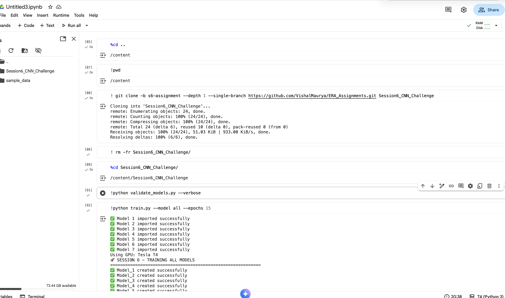

🎯 SESSION 6 - MODEL PARAMETER VALIDATION
======================================================================
Parameter Limit: 8,000
Total Models: 7

🔍 Validating Model_1...
   ✅ 4,379 params (✅ under limit)

🔍 Validating Model_2...
   ✅ 5,856 params (✅ under limit)

🔍 Validating Model_3...
   ✅ 7,362 params (✅ under limit)

🔍 Validating Model_4...
   ✅ 4,122 params (✅ under limit)

🔍 Validating Model_5...
   ✅ 5,688 params (✅ under limit)

🔍 Validating Model_6...
   ✅ 5,508 params (✅ under limit)

🔍 Validating Model_7...
   ✅ 1,442 params (✅ under limit)

============================================================
🏗️  Model_1 VALIDATION
============================================================
📊 Parameters: 4,379
🎯 Limit Check: 8,000
✅ PASSED: 4,379 < 8,000
💡 Margin: 3,621 parameters under limit
📈 Efficiency: 54.7% of budget used
🔧 Forward Pass: ✅ Successful

============================================================
🏗️  Model_2 VALIDATION
============================================================
📊 Parameters: 5,856
🎯 Limit Check: 8,000
✅ PASSED: 5,856 < 8,000
💡 Margin: 2,144 parameters under limit
📈 Efficiency: 73.2% of budget used
🔧 Forward Pass: ✅ Successful

============================================================
🏗️  Model_3 VALIDATION
============================================================
📊 Parameters: 7,362
🎯 Limit Check: 8,000
✅ PASSED: 7,362 < 8,000
💡 Margin: 638 parameters under limit
📈 Efficiency: 92.0% of budget used
🔧 Forward Pass: ✅ Successful

============================================================
🏗️  Model_4 VALIDATION
============================================================
📊 Parameters: 4,122
🎯 Limit Check: 8,000
✅ PASSED: 4,122 < 8,000
💡 Margin: 3,878 parameters under limit
📈 Efficiency: 51.5% of budget used
🔧 Forward Pass: ✅ Successful

============================================================
🏗️  Model_5 VALIDATION
============================================================
📊 Parameters: 5,688
🎯 Limit Check: 8,000
✅ PASSED: 5,688 < 8,000
💡 Margin: 2,312 parameters under limit
📈 Efficiency: 71.1% of budget used
🔧 Forward Pass: ✅ Successful

============================================================
🏗️  Model_6 VALIDATION
============================================================
📊 Parameters: 5,508
🎯 Limit Check: 8,000
✅ PASSED: 5,508 < 8,000
💡 Margin: 2,492 parameters under limit
📈 Efficiency: 68.8% of budget used
🔧 Forward Pass: ✅ Successful

============================================================
🏗️  Model_7 VALIDATION
============================================================
📊 Parameters: 1,442
🎯 Limit Check: 8,000
✅ PASSED: 1,442 < 8,000
💡 Margin: 6,558 parameters under limit
📈 Efficiency: 18.0% of budget used
🔧 Forward Pass: ✅ Successful

======================================================================
📋 COMPREHENSIVE VALIDATION REPORT
======================================================================

📊 SUMMARY STATISTICS:
   Total Models: 7
   Successfully Loaded: 7
   Parameter Compliant: 7
   Compliance Rate: 100.0%

📋 DETAILED RESULTS:
Model      Parameters   Status          Margin       Efficiency  
----------------------------------------------------------------------
Model_1    4379         ✅ PASSED        +3,621       54.7%       
Model_2    5856         ✅ PASSED        +2,144       73.2%       
Model_3    7362         ✅ PASSED        +638         92.0%       
Model_4    4122         ✅ PASSED        +3,878       51.5%       
Model_5    5688         ✅ PASSED        +2,312       71.1%       
Model_6    5508         ✅ PASSED        +2,492       68.8%       
Model_7    1442         ✅ PASSED        +6,558       18.0%       

🎯 FINAL VERDICT:
🎉 ALL MODELS PASSED! Ready for training.
  -----------

✅ Model 1 imported successfully
✅ Model 2 imported successfully
✅ Model 3 imported successfully
✅ Model 4 imported successfully
✅ Model 5 imported successfully
✅ Model 6 imported successfully
✅ Model 7 imported successfully
Using GPU: Tesla T4
🚀 SESSION 6 - TRAINING ALL MODELS
============================================================
✅ Model_1 created successfully
✅ Model_2 created successfully
✅ Model_3 created successfully
✅ Model_4 created successfully
✅ Model_5 created successfully
✅ Model_6 created successfully
✅ Model_7 created successfully

📊 Successfully created 7/7 models
✅ Model_1 analysis completed

📊 PRE-TRAINING ANALYSIS - Model_1
Parameters: 4,379
Target Accuracy: 97-98%
Strategy: Basic CNN + BatchNorm + Dropout + GAP (Curriculum)
✅ Parameter constraint satisfied: 3,621 under limit

============================================================
TRAINING MODEL_1
============================================================
📈 Using data augmentation: rotations ±7° and translations ±10%
100% 9.91M/9.91M [00:00<00:00, 19.0MB/s]
100% 28.9k/28.9k [00:00<00:00, 506kB/s]
100% 1.65M/1.65M [00:00<00:00, 4.62MB/s]
100% 4.54k/4.54k [00:00<00:00, 20.0MB/s]
📊 Using MultiStepLR scheduler: milestones=[6,10,13], gamma=0.1 (Code 10)
Epoch 1, Batch 0/469, Loss: 2.3284, Acc: 8.59%
Epoch 1, Batch 100/469, Loss: 0.8122, Acc: 48.41%
Epoch 1, Batch 200/469, Loss: 0.4646, Acc: 67.70%
Epoch 1, Batch 300/469, Loss: 0.2623, Acc: 75.60%
Epoch 1, Batch 400/469, Loss: 0.1689, Acc: 79.81%
Epoch  1/15 | Time: 21.2s | LR: 0.010000
Train Loss: 0.6053 | Train Acc: 81.61%
Test  Loss: 0.2058 | Test  Acc: 93.61%
🎯 New best accuracy: 93.61%
------------------------------------------------------------
Epoch 2, Batch 0/469, Loss: 0.1887, Acc: 94.53%
Epoch 2, Batch 100/469, Loss: 0.2734, Acc: 93.06%
Epoch 2, Batch 200/469, Loss: 0.2020, Acc: 93.33%
Epoch 2, Batch 300/469, Loss: 0.2022, Acc: 93.52%
Epoch 2, Batch 400/469, Loss: 0.2340, Acc: 93.76%
Epoch  2/15 | Time: 21.9s | LR: 0.010000
Train Loss: 0.2111 | Train Acc: 93.75%
Test  Loss: 0.1091 | Test  Acc: 96.86%
🎯 New best accuracy: 96.86%
------------------------------------------------------------
Epoch 3, Batch 0/469, Loss: 0.1068, Acc: 97.66%
Epoch 3, Batch 100/469, Loss: 0.0488, Acc: 94.49%
Epoch 3, Batch 200/469, Loss: 0.2421, Acc: 94.26%
Epoch 3, Batch 300/469, Loss: 0.1779, Acc: 94.30%
Epoch 3, Batch 400/469, Loss: 0.1184, Acc: 94.45%
Epoch  3/15 | Time: 21.9s | LR: 0.010000
Train Loss: 0.1826 | Train Acc: 94.47%
Test  Loss: 0.1094 | Test  Acc: 96.71%
------------------------------------------------------------
Epoch 4, Batch 0/469, Loss: 0.2027, Acc: 94.53%
Epoch 4, Batch 100/469, Loss: 0.1726, Acc: 95.13%
Epoch 4, Batch 200/469, Loss: 0.1256, Acc: 95.06%
Epoch 4, Batch 300/469, Loss: 0.2151, Acc: 95.15%
Epoch 4, Batch 400/469, Loss: 0.1045, Acc: 95.23%
Epoch  4/15 | Time: 20.9s | LR: 0.010000
Train Loss: 0.1573 | Train Acc: 95.30%
Test  Loss: 0.1039 | Test  Acc: 96.85%
------------------------------------------------------------
Epoch 5, Batch 0/469, Loss: 0.2173, Acc: 92.19%
Epoch 5, Batch 100/469, Loss: 0.2046, Acc: 95.44%
Epoch 5, Batch 200/469, Loss: 0.2257, Acc: 95.51%
Epoch 5, Batch 300/469, Loss: 0.1182, Acc: 95.66%
Epoch 5, Batch 400/469, Loss: 0.1545, Acc: 95.63%
Epoch  5/15 | Time: 21.7s | LR: 0.010000
Train Loss: 0.1492 | Train Acc: 95.58%
Test  Loss: 0.0978 | Test  Acc: 96.89%
🎯 New best accuracy: 96.89%
------------------------------------------------------------
Epoch 6, Batch 0/469, Loss: 0.1278, Acc: 95.31%
Epoch 6, Batch 100/469, Loss: 0.0374, Acc: 95.83%
Epoch 6, Batch 200/469, Loss: 0.1340, Acc: 95.88%
Epoch 6, Batch 300/469, Loss: 0.1690, Acc: 95.96%
Epoch 6, Batch 400/469, Loss: 0.1050, Acc: 95.83%
Epoch  6/15 | Time: 21.7s | LR: 0.001000
Train Loss: 0.1426 | Train Acc: 95.73%
Test  Loss: 0.1142 | Test  Acc: 96.38%
------------------------------------------------------------
Epoch 7, Batch 0/469, Loss: 0.1796, Acc: 94.53%
Epoch 7, Batch 100/469, Loss: 0.0864, Acc: 96.18%
Epoch 7, Batch 200/469, Loss: 0.1021, Acc: 96.45%
Epoch 7, Batch 300/469, Loss: 0.1171, Acc: 96.55%
Epoch 7, Batch 400/469, Loss: 0.1133, Acc: 96.61%
Epoch  7/15 | Time: 20.5s | LR: 0.001000
Train Loss: 0.1101 | Train Acc: 96.66%
Test  Loss: 0.0540 | Test  Acc: 98.38%
🎯 New best accuracy: 98.38%
------------------------------------------------------------
Epoch 8, Batch 0/469, Loss: 0.0700, Acc: 98.44%
Epoch 8, Batch 100/469, Loss: 0.1417, Acc: 96.69%
Epoch 8, Batch 200/469, Loss: 0.1177, Acc: 96.75%
Epoch 8, Batch 300/469, Loss: 0.1421, Acc: 96.96%
Epoch 8, Batch 400/469, Loss: 0.0585, Acc: 96.95%
Epoch  8/15 | Time: 21.3s | LR: 0.001000
Train Loss: 0.1018 | Train Acc: 96.90%
Test  Loss: 0.0514 | Test  Acc: 98.45%
🎯 New best accuracy: 98.45%
------------------------------------------------------------
Epoch 9, Batch 0/469, Loss: 0.1790, Acc: 96.88%
Epoch 9, Batch 100/469, Loss: 0.1725, Acc: 97.09%
Epoch 9, Batch 200/469, Loss: 0.0649, Acc: 97.01%
Epoch 9, Batch 300/469, Loss: 0.0610, Acc: 96.98%
Epoch 9, Batch 400/469, Loss: 0.0955, Acc: 96.90%
Epoch  9/15 | Time: 21.6s | LR: 0.001000
Train Loss: 0.1021 | Train Acc: 96.94%
Test  Loss: 0.0508 | Test  Acc: 98.44%
------------------------------------------------------------
Epoch 10, Batch 0/469, Loss: 0.0832, Acc: 95.31%
Epoch 10, Batch 100/469, Loss: 0.0917, Acc: 97.06%
Epoch 10, Batch 200/469, Loss: 0.0805, Acc: 96.99%
Epoch 10, Batch 300/469, Loss: 0.1255, Acc: 96.97%
Epoch 10, Batch 400/469, Loss: 0.1419, Acc: 96.97%
Epoch 10/15 | Time: 20.7s | LR: 0.000100
Train Loss: 0.1005 | Train Acc: 96.99%
Test  Loss: 0.0499 | Test  Acc: 98.54%
🎯 New best accuracy: 98.54%
------------------------------------------------------------
Epoch 11, Batch 0/469, Loss: 0.0829, Acc: 97.66%
Epoch 11, Batch 100/469, Loss: 0.0609, Acc: 96.98%
Epoch 11, Batch 200/469, Loss: 0.0581, Acc: 97.04%
Epoch 11, Batch 300/469, Loss: 0.0825, Acc: 97.14%
Epoch 11, Batch 400/469, Loss: 0.1154, Acc: 97.12%
Epoch 11/15 | Time: 21.9s | LR: 0.000100
Train Loss: 0.0951 | Train Acc: 97.07%
Test  Loss: 0.0482 | Test  Acc: 98.52%
⚠️  Below target: 98.52% < 99.4%
------------------------------------------------------------
Epoch 12, Batch 0/469, Loss: 0.0923, Acc: 97.66%
Epoch 12, Batch 100/469, Loss: 0.0594, Acc: 97.08%
Epoch 12, Batch 200/469, Loss: 0.0460, Acc: 97.10%
Epoch 12, Batch 300/469, Loss: 0.0686, Acc: 97.11%
Epoch 12, Batch 400/469, Loss: 0.0564, Acc: 97.10%
Epoch 12/15 | Time: 21.8s | LR: 0.000100
Train Loss: 0.0956 | Train Acc: 97.10%
Test  Loss: 0.0489 | Test  Acc: 98.54%
⚠️  Below target: 98.54% < 99.4%
------------------------------------------------------------
Epoch 13, Batch 0/469, Loss: 0.0848, Acc: 98.44%
Epoch 13, Batch 100/469, Loss: 0.0503, Acc: 96.98%
Epoch 13, Batch 200/469, Loss: 0.1047, Acc: 97.04%
Epoch 13, Batch 300/469, Loss: 0.0935, Acc: 97.15%
Epoch 13, Batch 400/469, Loss: 0.1951, Acc: 97.10%
Epoch 13/15 | Time: 20.8s | LR: 0.000010
Train Loss: 0.0970 | Train Acc: 97.08%
Test  Loss: 0.0474 | Test  Acc: 98.55%
🎯 New best accuracy: 98.55%
⚠️  Below target: 98.55% < 99.4%
------------------------------------------------------------
Epoch 14, Batch 0/469, Loss: 0.1350, Acc: 96.88%
Epoch 14, Batch 100/469, Loss: 0.1343, Acc: 96.93%
Epoch 14, Batch 200/469, Loss: 0.0518, Acc: 96.96%
Epoch 14, Batch 300/469, Loss: 0.0877, Acc: 97.03%
Epoch 14, Batch 400/469, Loss: 0.1085, Acc: 97.07%
Epoch 14/15 | Time: 22.2s | LR: 0.000010
Train Loss: 0.0938 | Train Acc: 97.10%
Test  Loss: 0.0480 | Test  Acc: 98.54%
⚠️  Below target: 98.54% < 99.4%
------------------------------------------------------------
Epoch 15, Batch 0/469, Loss: 0.0678, Acc: 97.66%
Epoch 15, Batch 100/469, Loss: 0.1088, Acc: 97.35%
Epoch 15, Batch 200/469, Loss: 0.1082, Acc: 97.23%
Epoch 15, Batch 300/469, Loss: 0.0836, Acc: 97.16%
Epoch 15, Batch 400/469, Loss: 0.0516, Acc: 97.16%
Epoch 15/15 | Time: 22.2s | LR: 0.000010
Train Loss: 0.0959 | Train Acc: 97.17%
Test  Loss: 0.0489 | Test  Acc: 98.53%
⚠️  Below target: 98.53% < 99.4%
------------------------------------------------------------

🏆 FINAL RESULTS for Model_1:
   Parameters: 4,379
   Best Accuracy: 98.55%
   Final 5 Epochs Avg: 98.54%
   Consistency Target: ❌ NOT ACHIEVED
   Training Time: 322.5s
✅ Model_2 analysis completed

📊 PRE-TRAINING ANALYSIS - Model_2
Parameters: 5,856
Target Accuracy: 99.2-99.3%
Strategy: Enhanced Blocks + Optimized Pooling + FC Layers (Curriculum)
✅ Parameter constraint satisfied: 2,144 under limit

============================================================
TRAINING MODEL_2
============================================================
📈 Using data augmentation: rotations ±7° and translations ±10%
📊 Using MultiStepLR scheduler: milestones=[6,10,13], gamma=0.1 (Code 10)
Epoch 1, Batch 0/469, Loss: 2.3398, Acc: 11.72%
Epoch 1, Batch 100/469, Loss: 0.6672, Acc: 58.62%
Epoch 1, Batch 200/469, Loss: 0.2948, Acc: 73.73%
Epoch 1, Batch 300/469, Loss: 0.2048, Acc: 79.80%
Epoch 1, Batch 400/469, Loss: 0.1510, Acc: 83.24%
Epoch  1/15 | Time: 21.1s | LR: 0.010000
Train Loss: 0.5052 | Train Acc: 84.83%
Test  Loss: 0.1249 | Test  Acc: 96.21%
🎯 New best accuracy: 96.21%
------------------------------------------------------------
Epoch 2, Batch 0/469, Loss: 0.2907, Acc: 92.19%
Epoch 2, Batch 100/469, Loss: 0.2151, Acc: 94.31%
Epoch 2, Batch 200/469, Loss: 0.2267, Acc: 94.64%
Epoch 2, Batch 300/469, Loss: 0.1588, Acc: 94.87%
Epoch 2, Batch 400/469, Loss: 0.1535, Acc: 95.01%
Epoch  2/15 | Time: 20.8s | LR: 0.010000
Train Loss: 0.1666 | Train Acc: 95.11%
Test  Loss: 0.1130 | Test  Acc: 96.32%
🎯 New best accuracy: 96.32%
------------------------------------------------------------
Epoch 3, Batch 0/469, Loss: 0.1588, Acc: 95.31%
Epoch 3, Batch 100/469, Loss: 0.1016, Acc: 96.02%
Epoch 3, Batch 200/469, Loss: 0.0597, Acc: 95.83%
Epoch 3, Batch 300/469, Loss: 0.1512, Acc: 95.86%
Epoch 3, Batch 400/469, Loss: 0.0851, Acc: 95.98%
Epoch  3/15 | Time: 21.7s | LR: 0.010000
Train Loss: 0.1324 | Train Acc: 96.06%
Test  Loss: 0.0835 | Test  Acc: 97.39%
🎯 New best accuracy: 97.39%
------------------------------------------------------------
Epoch 4, Batch 0/469, Loss: 0.0983, Acc: 98.44%
Epoch 4, Batch 100/469, Loss: 0.1061, Acc: 96.30%
Epoch 4, Batch 200/469, Loss: 0.0721, Acc: 96.19%
Epoch 4, Batch 300/469, Loss: 0.2233, Acc: 96.26%
Epoch 4, Batch 400/469, Loss: 0.0512, Acc: 96.35%
Epoch  4/15 | Time: 20.6s | LR: 0.010000
Train Loss: 0.1179 | Train Acc: 96.36%
Test  Loss: 0.0684 | Test  Acc: 97.99%
🎯 New best accuracy: 97.99%
------------------------------------------------------------
Epoch 5, Batch 0/469, Loss: 0.2268, Acc: 92.97%
Epoch 5, Batch 100/469, Loss: 0.1042, Acc: 96.58%
Epoch 5, Batch 200/469, Loss: 0.0856, Acc: 96.69%
Epoch 5, Batch 300/469, Loss: 0.0534, Acc: 96.78%
Epoch 5, Batch 400/469, Loss: 0.0729, Acc: 96.71%
Epoch  5/15 | Time: 22.2s | LR: 0.010000
Train Loss: 0.1089 | Train Acc: 96.74%
Test  Loss: 0.0648 | Test  Acc: 98.11%
🎯 New best accuracy: 98.11%
------------------------------------------------------------
Epoch 6, Batch 0/469, Loss: 0.1415, Acc: 94.53%
Epoch 6, Batch 100/469, Loss: 0.0733, Acc: 96.91%
Epoch 6, Batch 200/469, Loss: 0.0991, Acc: 96.86%
Epoch 6, Batch 300/469, Loss: 0.1694, Acc: 96.88%
Epoch 6, Batch 400/469, Loss: 0.1063, Acc: 96.91%
Epoch  6/15 | Time: 22.5s | LR: 0.001000
Train Loss: 0.1037 | Train Acc: 96.90%
Test  Loss: 0.0626 | Test  Acc: 97.97%
------------------------------------------------------------
Epoch 7, Batch 0/469, Loss: 0.0694, Acc: 97.66%
Epoch 7, Batch 100/469, Loss: 0.0586, Acc: 97.48%
Epoch 7, Batch 200/469, Loss: 0.0413, Acc: 97.43%
Epoch 7, Batch 300/469, Loss: 0.0917, Acc: 97.51%
Epoch 7, Batch 400/469, Loss: 0.0657, Acc: 97.55%
Epoch  7/15 | Time: 22.3s | LR: 0.001000
Train Loss: 0.0808 | Train Acc: 97.55%
Test  Loss: 0.0418 | Test  Acc: 98.65%
🎯 New best accuracy: 98.65%
------------------------------------------------------------
Epoch 8, Batch 0/469, Loss: 0.0659, Acc: 97.66%
Epoch 8, Batch 100/469, Loss: 0.0835, Acc: 97.59%
Epoch 8, Batch 200/469, Loss: 0.1348, Acc: 97.72%
Epoch 8, Batch 300/469, Loss: 0.0576, Acc: 97.77%
Epoch 8, Batch 400/469, Loss: 0.0580, Acc: 97.73%
Epoch  8/15 | Time: 21.1s | LR: 0.001000
Train Loss: 0.0768 | Train Acc: 97.71%
Test  Loss: 0.0392 | Test  Acc: 98.84%
🎯 New best accuracy: 98.84%
------------------------------------------------------------
Epoch 9, Batch 0/469, Loss: 0.0587, Acc: 97.66%
Epoch 9, Batch 100/469, Loss: 0.1317, Acc: 97.69%
Epoch 9, Batch 200/469, Loss: 0.0748, Acc: 97.75%
Epoch 9, Batch 300/469, Loss: 0.0222, Acc: 97.81%
Epoch 9, Batch 400/469, Loss: 0.0505, Acc: 97.82%
Epoch  9/15 | Time: 22.2s | LR: 0.001000
Train Loss: 0.0739 | Train Acc: 97.83%
Test  Loss: 0.0375 | Test  Acc: 98.89%
🎯 New best accuracy: 98.89%
------------------------------------------------------------
Epoch 10, Batch 0/469, Loss: 0.0282, Acc: 99.22%
Epoch 10, Batch 100/469, Loss: 0.0497, Acc: 97.87%
Epoch 10, Batch 200/469, Loss: 0.0687, Acc: 97.89%
Epoch 10, Batch 300/469, Loss: 0.0863, Acc: 97.86%
Epoch 10, Batch 400/469, Loss: 0.0497, Acc: 97.86%
Epoch 10/15 | Time: 22.0s | LR: 0.000100
Train Loss: 0.0734 | Train Acc: 97.82%
Test  Loss: 0.0392 | Test  Acc: 98.79%
------------------------------------------------------------
Epoch 11, Batch 0/469, Loss: 0.0605, Acc: 97.66%
Epoch 11, Batch 100/469, Loss: 0.0352, Acc: 97.87%
Epoch 11, Batch 200/469, Loss: 0.0640, Acc: 97.97%
Epoch 11, Batch 300/469, Loss: 0.0837, Acc: 97.97%
Epoch 11, Batch 400/469, Loss: 0.0629, Acc: 97.98%
Epoch 11/15 | Time: 20.9s | LR: 0.000100
Train Loss: 0.0705 | Train Acc: 97.94%
Test  Loss: 0.0375 | Test  Acc: 98.92%
🎯 New best accuracy: 98.92%
⚠️  Below target: 98.92% < 99.4%
------------------------------------------------------------
Epoch 12, Batch 0/469, Loss: 0.0605, Acc: 98.44%
Epoch 12, Batch 100/469, Loss: 0.0308, Acc: 97.70%
Epoch 12, Batch 200/469, Loss: 0.0513, Acc: 97.89%
Epoch 12, Batch 300/469, Loss: 0.0708, Acc: 97.96%
Epoch 12, Batch 400/469, Loss: 0.0603, Acc: 98.00%
Epoch 12/15 | Time: 21.8s | LR: 0.000100
Train Loss: 0.0697 | Train Acc: 97.97%
Test  Loss: 0.0374 | Test  Acc: 98.85%
⚠️  Below target: 98.85% < 99.4%
------------------------------------------------------------
Epoch 13, Batch 0/469, Loss: 0.0382, Acc: 100.00%
Epoch 13, Batch 100/469, Loss: 0.0608, Acc: 97.96%
Epoch 13, Batch 200/469, Loss: 0.0479, Acc: 98.08%
Epoch 13, Batch 300/469, Loss: 0.0270, Acc: 98.05%
Epoch 13, Batch 400/469, Loss: 0.0692, Acc: 98.08%
Epoch 13/15 | Time: 22.3s | LR: 0.000010
Train Loss: 0.0681 | Train Acc: 98.04%
Test  Loss: 0.0357 | Test  Acc: 98.99%
🎯 New best accuracy: 98.99%
⚠️  Below target: 98.99% < 99.4%
------------------------------------------------------------
Epoch 14, Batch 0/469, Loss: 0.0627, Acc: 98.44%
Epoch 14, Batch 100/469, Loss: 0.0909, Acc: 98.25%
Epoch 14, Batch 200/469, Loss: 0.0393, Acc: 98.17%
Epoch 14, Batch 300/469, Loss: 0.0553, Acc: 98.05%
Epoch 14, Batch 400/469, Loss: 0.0312, Acc: 98.04%
Epoch 14/15 | Time: 22.1s | LR: 0.000010
Train Loss: 0.0678 | Train Acc: 98.04%
Test  Loss: 0.0368 | Test  Acc: 98.93%
⚠️  Below target: 98.93% < 99.4%
------------------------------------------------------------
Epoch 15, Batch 0/469, Loss: 0.0395, Acc: 99.22%
Epoch 15, Batch 100/469, Loss: 0.0385, Acc: 98.00%
Epoch 15, Batch 200/469, Loss: 0.0354, Acc: 98.01%
Epoch 15, Batch 300/469, Loss: 0.0896, Acc: 98.00%
Epoch 15, Batch 400/469, Loss: 0.1165, Acc: 97.99%
Epoch 15/15 | Time: 21.8s | LR: 0.000010
Train Loss: 0.0692 | Train Acc: 97.99%
Test  Loss: 0.0363 | Test  Acc: 98.96%
⚠️  Below target: 98.96% < 99.4%
------------------------------------------------------------

🏆 FINAL RESULTS for Model_2:
   Parameters: 5,856
   Best Accuracy: 98.99%
   Final 5 Epochs Avg: 98.93%
   Consistency Target: ❌ NOT ACHIEVED
   Training Time: 325.4s
✅ Model_3 analysis completed

📊 PRE-TRAINING ANALYSIS - Model_3
Parameters: 7,362
Target Accuracy: 99.4%+ consistently
Strategy: Enhanced precision architecture with dual attention
✅ Parameter constraint satisfied: 638 under limit

============================================================
TRAINING MODEL_3
============================================================
📈 Using data augmentation: rotations ±7° and translations ±10%
📊 Using MultiStepLR scheduler: milestones=[6,10,13], gamma=0.1 (Code 10)
Epoch 1, Batch 0/469, Loss: 2.3072, Acc: 8.59%
Epoch 1, Batch 100/469, Loss: 0.3537, Acc: 64.06%
Epoch 1, Batch 200/469, Loss: 0.3739, Acc: 77.46%
Epoch 1, Batch 300/469, Loss: 0.2231, Acc: 82.49%
Epoch 1, Batch 400/469, Loss: 0.2042, Acc: 85.29%
Epoch  1/15 | Time: 23.2s | LR: 0.010000
Train Loss: 0.4387 | Train Acc: 86.61%
Test  Loss: 0.1659 | Test  Acc: 95.15%
🎯 New best accuracy: 95.15%
------------------------------------------------------------
Epoch 2, Batch 0/469, Loss: 0.1382, Acc: 96.88%
Epoch 2, Batch 100/469, Loss: 0.1699, Acc: 94.46%
Epoch 2, Batch 200/469, Loss: 0.3718, Acc: 94.93%
Epoch 2, Batch 300/469, Loss: 0.1838, Acc: 95.11%
Epoch 2, Batch 400/469, Loss: 0.1182, Acc: 95.20%
Epoch  2/15 | Time: 22.8s | LR: 0.010000
Train Loss: 0.1536 | Train Acc: 95.33%
Test  Loss: 0.1694 | Test  Acc: 95.02%
------------------------------------------------------------
Epoch 3, Batch 0/469, Loss: 0.1272, Acc: 92.97%
Epoch 3, Batch 100/469, Loss: 0.1574, Acc: 96.01%
Epoch 3, Batch 200/469, Loss: 0.1402, Acc: 95.93%
Epoch 3, Batch 300/469, Loss: 0.1943, Acc: 96.01%
Epoch 3, Batch 400/469, Loss: 0.0895, Acc: 96.09%
Epoch  3/15 | Time: 22.9s | LR: 0.010000
Train Loss: 0.1277 | Train Acc: 96.17%
Test  Loss: 0.1005 | Test  Acc: 96.79%
🎯 New best accuracy: 96.79%
------------------------------------------------------------
Epoch 4, Batch 0/469, Loss: 0.0718, Acc: 99.22%
Epoch 4, Batch 100/469, Loss: 0.0713, Acc: 96.53%
Epoch 4, Batch 200/469, Loss: 0.0707, Acc: 96.40%
Epoch 4, Batch 300/469, Loss: 0.1216, Acc: 96.52%
Epoch 4, Batch 400/469, Loss: 0.1229, Acc: 96.57%
Epoch  4/15 | Time: 21.7s | LR: 0.010000
Train Loss: 0.1151 | Train Acc: 96.53%
Test  Loss: 0.0805 | Test  Acc: 97.65%
🎯 New best accuracy: 97.65%
------------------------------------------------------------
Epoch 5, Batch 0/469, Loss: 0.1147, Acc: 95.31%
Epoch 5, Batch 100/469, Loss: 0.1328, Acc: 96.65%
Epoch 5, Batch 200/469, Loss: 0.1040, Acc: 96.81%
Epoch 5, Batch 300/469, Loss: 0.1124, Acc: 96.90%
Epoch 5, Batch 400/469, Loss: 0.0753, Acc: 96.90%
Epoch  5/15 | Time: 22.5s | LR: 0.010000
Train Loss: 0.1027 | Train Acc: 96.93%
Test  Loss: 0.0837 | Test  Acc: 97.25%
------------------------------------------------------------
Epoch 6, Batch 0/469, Loss: 0.1315, Acc: 93.75%
Epoch 6, Batch 100/469, Loss: 0.0842, Acc: 97.16%
Epoch 6, Batch 200/469, Loss: 0.1241, Acc: 97.10%
Epoch 6, Batch 300/469, Loss: 0.1494, Acc: 97.07%
Epoch 6, Batch 400/469, Loss: 0.0784, Acc: 97.03%
Epoch  6/15 | Time: 22.4s | LR: 0.001000
Train Loss: 0.0993 | Train Acc: 97.01%
Test  Loss: 0.0563 | Test  Acc: 98.35%
🎯 New best accuracy: 98.35%
------------------------------------------------------------
Epoch 7, Batch 0/469, Loss: 0.0279, Acc: 99.22%
Epoch 7, Batch 100/469, Loss: 0.1107, Acc: 97.44%
Epoch 7, Batch 200/469, Loss: 0.0404, Acc: 97.49%
Epoch 7, Batch 300/469, Loss: 0.0611, Acc: 97.62%
Epoch 7, Batch 400/469, Loss: 0.0542, Acc: 97.65%
Epoch  7/15 | Time: 22.5s | LR: 0.001000
Train Loss: 0.0741 | Train Acc: 97.68%
Test  Loss: 0.0397 | Test  Acc: 98.61%
🎯 New best accuracy: 98.61%
------------------------------------------------------------
Epoch 8, Batch 0/469, Loss: 0.1162, Acc: 96.88%
Epoch 8, Batch 100/469, Loss: 0.0454, Acc: 97.89%
Epoch 8, Batch 200/469, Loss: 0.0213, Acc: 97.99%
Epoch 8, Batch 300/469, Loss: 0.0588, Acc: 97.88%
Epoch 8, Batch 400/469, Loss: 0.0491, Acc: 97.92%
Epoch  8/15 | Time: 21.8s | LR: 0.001000
Train Loss: 0.0678 | Train Acc: 97.92%
Test  Loss: 0.0361 | Test  Acc: 98.69%
🎯 New best accuracy: 98.69%
------------------------------------------------------------
Epoch 9, Batch 0/469, Loss: 0.0201, Acc: 99.22%
Epoch 9, Batch 100/469, Loss: 0.0808, Acc: 98.02%
Epoch 9, Batch 200/469, Loss: 0.1312, Acc: 98.03%
Epoch 9, Batch 300/469, Loss: 0.0319, Acc: 97.98%
Epoch 9, Batch 400/469, Loss: 0.0705, Acc: 98.01%
Epoch  9/15 | Time: 21.7s | LR: 0.001000
Train Loss: 0.0660 | Train Acc: 98.00%
Test  Loss: 0.0388 | Test  Acc: 98.70%
🎯 New best accuracy: 98.70%
------------------------------------------------------------
Epoch 10, Batch 0/469, Loss: 0.0460, Acc: 98.44%
Epoch 10, Batch 100/469, Loss: 0.0391, Acc: 97.95%
Epoch 10, Batch 200/469, Loss: 0.0527, Acc: 97.97%
Epoch 10, Batch 300/469, Loss: 0.0314, Acc: 98.02%
Epoch 10, Batch 400/469, Loss: 0.0548, Acc: 98.02%
Epoch 10/15 | Time: 22.3s | LR: 0.000100
Train Loss: 0.0648 | Train Acc: 98.00%
Test  Loss: 0.0349 | Test  Acc: 98.83%
🎯 New best accuracy: 98.83%
------------------------------------------------------------
Epoch 11, Batch 0/469, Loss: 0.1645, Acc: 96.09%
Epoch 11, Batch 100/469, Loss: 0.0738, Acc: 98.06%
Epoch 11, Batch 200/469, Loss: 0.0094, Acc: 98.06%
Epoch 11, Batch 300/469, Loss: 0.1026, Acc: 98.13%
Epoch 11, Batch 400/469, Loss: 0.1142, Acc: 98.13%
Epoch 11/15 | Time: 22.5s | LR: 0.000100
Train Loss: 0.0629 | Train Acc: 98.16%
Test  Loss: 0.0342 | Test  Acc: 98.76%
⚠️  Below target: 98.76% < 99.4%
------------------------------------------------------------
Epoch 12, Batch 0/469, Loss: 0.0962, Acc: 95.31%
Epoch 12, Batch 100/469, Loss: 0.0333, Acc: 98.26%
Epoch 12, Batch 200/469, Loss: 0.0696, Acc: 98.16%
Epoch 12, Batch 300/469, Loss: 0.0482, Acc: 98.11%
Epoch 12, Batch 400/469, Loss: 0.0732, Acc: 98.09%
Epoch 12/15 | Time: 22.7s | LR: 0.000100
Train Loss: 0.0618 | Train Acc: 98.11%
Test  Loss: 0.0352 | Test  Acc: 98.77%
⚠️  Below target: 98.77% < 99.4%
------------------------------------------------------------
Epoch 13, Batch 0/469, Loss: 0.0567, Acc: 98.44%
Epoch 13, Batch 100/469, Loss: 0.1041, Acc: 98.15%
Epoch 13, Batch 200/469, Loss: 0.0256, Acc: 98.14%
Epoch 13, Batch 300/469, Loss: 0.0740, Acc: 98.20%
Epoch 13, Batch 400/469, Loss: 0.0337, Acc: 98.18%
Epoch 13/15 | Time: 21.6s | LR: 0.000010
Train Loss: 0.0604 | Train Acc: 98.19%
Test  Loss: 0.0340 | Test  Acc: 98.81%
⚠️  Below target: 98.81% < 99.4%
------------------------------------------------------------
Epoch 14, Batch 0/469, Loss: 0.0764, Acc: 96.88%
Epoch 14, Batch 100/469, Loss: 0.0921, Acc: 98.02%
Epoch 14, Batch 200/469, Loss: 0.1401, Acc: 98.16%
Epoch 14, Batch 300/469, Loss: 0.0634, Acc: 98.14%
Epoch 14, Batch 400/469, Loss: 0.0618, Acc: 98.12%
Epoch 14/15 | Time: 22.4s | LR: 0.000010
Train Loss: 0.0612 | Train Acc: 98.15%
Test  Loss: 0.0349 | Test  Acc: 98.77%
⚠️  Below target: 98.77% < 99.4%
------------------------------------------------------------
Epoch 15, Batch 0/469, Loss: 0.1162, Acc: 96.09%
Epoch 15, Batch 100/469, Loss: 0.0725, Acc: 98.10%
Epoch 15, Batch 200/469, Loss: 0.0428, Acc: 98.08%
Epoch 15, Batch 300/469, Loss: 0.0166, Acc: 98.13%
Epoch 15, Batch 400/469, Loss: 0.0207, Acc: 98.07%
Epoch 15/15 | Time: 22.4s | LR: 0.000010
Train Loss: 0.0630 | Train Acc: 98.07%
Test  Loss: 0.0345 | Test  Acc: 98.77%
⚠️  Below target: 98.77% < 99.4%
------------------------------------------------------------

🏆 FINAL RESULTS for Model_3:
   Parameters: 7,362
   Best Accuracy: 98.83%
   Final 5 Epochs Avg: 98.78%
   Consistency Target: ❌ NOT ACHIEVED
   Training Time: 335.4s
✅ Model_4 analysis completed

📊 PRE-TRAINING ANALYSIS - Model_4
Parameters: 4,122
Target Accuracy: 99.4%+
Strategy: Fast Convergence Blocks + Optimal RF + Strategic Capacity (Curriculum)
✅ Parameter constraint satisfied: 3,878 under limit

============================================================
TRAINING MODEL_4
============================================================
📈 Using data augmentation: rotations ±7° and translations ±10%
📊 Using MultiStepLR scheduler: milestones=[6,10,13], gamma=0.1 (Code 10)
Epoch 1, Batch 0/469, Loss: 2.3235, Acc: 10.94%
Epoch 1, Batch 100/469, Loss: 0.6249, Acc: 56.36%
Epoch 1, Batch 200/469, Loss: 0.3701, Acc: 72.07%
Epoch 1, Batch 300/469, Loss: 0.2615, Acc: 78.31%
Epoch 1, Batch 400/469, Loss: 0.1582, Acc: 81.77%
Epoch  1/15 | Time: 21.4s | LR: 0.010000
Train Loss: 0.5471 | Train Acc: 83.43%
Test  Loss: 0.1617 | Test  Acc: 95.28%
🎯 New best accuracy: 95.28%
------------------------------------------------------------
Epoch 2, Batch 0/469, Loss: 0.2339, Acc: 90.62%
Epoch 2, Batch 100/469, Loss: 0.1536, Acc: 94.03%
Epoch 2, Batch 200/469, Loss: 0.2761, Acc: 93.90%
Epoch 2, Batch 300/469, Loss: 0.1099, Acc: 94.18%
Epoch 2, Batch 400/469, Loss: 0.1920, Acc: 94.33%
Epoch  2/15 | Time: 20.6s | LR: 0.010000
Train Loss: 0.1932 | Train Acc: 94.37%
Test  Loss: 0.1501 | Test  Acc: 95.76%
🎯 New best accuracy: 95.76%
------------------------------------------------------------
Epoch 3, Batch 0/469, Loss: 0.3318, Acc: 90.62%
Epoch 3, Batch 100/469, Loss: 0.0993, Acc: 95.41%
Epoch 3, Batch 200/469, Loss: 0.1875, Acc: 95.46%
Epoch 3, Batch 300/469, Loss: 0.1722, Acc: 95.41%
Epoch 3, Batch 400/469, Loss: 0.1225, Acc: 95.42%
Epoch  3/15 | Time: 21.5s | LR: 0.010000
Train Loss: 0.1547 | Train Acc: 95.47%
Test  Loss: 0.1047 | Test  Acc: 96.78%
🎯 New best accuracy: 96.78%
------------------------------------------------------------
Epoch 4, Batch 0/469, Loss: 0.1230, Acc: 94.53%
Epoch 4, Batch 100/469, Loss: 0.1456, Acc: 95.92%
Epoch 4, Batch 200/469, Loss: 0.1725, Acc: 95.89%
Epoch 4, Batch 300/469, Loss: 0.1971, Acc: 95.85%
Epoch 4, Batch 400/469, Loss: 0.1139, Acc: 95.82%
Epoch  4/15 | Time: 21.6s | LR: 0.010000
Train Loss: 0.1398 | Train Acc: 95.84%
Test  Loss: 0.0905 | Test  Acc: 97.26%
🎯 New best accuracy: 97.26%
------------------------------------------------------------
Epoch 5, Batch 0/469, Loss: 0.0857, Acc: 96.88%
Epoch 5, Batch 100/469, Loss: 0.1561, Acc: 95.94%
Epoch 5, Batch 200/469, Loss: 0.0957, Acc: 96.08%
Epoch 5, Batch 300/469, Loss: 0.1274, Acc: 96.12%
Epoch 5, Batch 400/469, Loss: 0.1358, Acc: 96.10%
Epoch  5/15 | Time: 20.6s | LR: 0.010000
Train Loss: 0.1285 | Train Acc: 96.12%
Test  Loss: 0.0789 | Test  Acc: 97.58%
🎯 New best accuracy: 97.58%
------------------------------------------------------------
Epoch 6, Batch 0/469, Loss: 0.0822, Acc: 99.22%
Epoch 6, Batch 100/469, Loss: 0.1069, Acc: 96.32%
Epoch 6, Batch 200/469, Loss: 0.0912, Acc: 96.08%
Epoch 6, Batch 300/469, Loss: 0.0876, Acc: 96.16%
Epoch 6, Batch 400/469, Loss: 0.0547, Acc: 96.25%
Epoch  6/15 | Time: 21.6s | LR: 0.001000
Train Loss: 0.1219 | Train Acc: 96.27%
Test  Loss: 0.0692 | Test  Acc: 97.81%
🎯 New best accuracy: 97.81%
------------------------------------------------------------
Epoch 7, Batch 0/469, Loss: 0.0452, Acc: 99.22%
Epoch 7, Batch 100/469, Loss: 0.0407, Acc: 96.82%
Epoch 7, Batch 200/469, Loss: 0.0238, Acc: 96.94%
Epoch 7, Batch 300/469, Loss: 0.0902, Acc: 97.03%
Epoch 7, Batch 400/469, Loss: 0.1035, Acc: 97.05%
Epoch  7/15 | Time: 21.6s | LR: 0.001000
Train Loss: 0.0972 | Train Acc: 97.06%
Test  Loss: 0.0522 | Test  Acc: 98.34%
🎯 New best accuracy: 98.34%
------------------------------------------------------------
Epoch 8, Batch 0/469, Loss: 0.1193, Acc: 96.88%
Epoch 8, Batch 100/469, Loss: 0.1563, Acc: 97.28%
Epoch 8, Batch 200/469, Loss: 0.0455, Acc: 97.17%
Epoch 8, Batch 300/469, Loss: 0.1095, Acc: 97.16%
Epoch 8, Batch 400/469, Loss: 0.0549, Acc: 97.17%
Epoch  8/15 | Time: 21.2s | LR: 0.001000
Train Loss: 0.0950 | Train Acc: 97.17%
Test  Loss: 0.0549 | Test  Acc: 98.19%
------------------------------------------------------------
Epoch 9, Batch 0/469, Loss: 0.0891, Acc: 97.66%
Epoch 9, Batch 100/469, Loss: 0.0575, Acc: 97.48%
Epoch 9, Batch 200/469, Loss: 0.0630, Acc: 97.54%
Epoch 9, Batch 300/469, Loss: 0.0507, Acc: 97.49%
Epoch 9, Batch 400/469, Loss: 0.2194, Acc: 97.37%
Epoch  9/15 | Time: 21.5s | LR: 0.001000
Train Loss: 0.0906 | Train Acc: 97.37%
Test  Loss: 0.0496 | Test  Acc: 98.43%
🎯 New best accuracy: 98.43%
------------------------------------------------------------
Epoch 10, Batch 0/469, Loss: 0.0833, Acc: 97.66%
Epoch 10, Batch 100/469, Loss: 0.0615, Acc: 97.26%
Epoch 10, Batch 200/469, Loss: 0.0744, Acc: 97.31%
Epoch 10, Batch 300/469, Loss: 0.0755, Acc: 97.28%
Epoch 10, Batch 400/469, Loss: 0.0603, Acc: 97.28%
Epoch 10/15 | Time: 21.9s | LR: 0.000100
Train Loss: 0.0886 | Train Acc: 97.34%
Test  Loss: 0.0487 | Test  Acc: 98.41%
------------------------------------------------------------
Epoch 11, Batch 0/469, Loss: 0.0702, Acc: 96.88%
Epoch 11, Batch 100/469, Loss: 0.0912, Acc: 97.41%
Epoch 11, Batch 200/469, Loss: 0.0946, Acc: 97.37%
Epoch 11, Batch 300/469, Loss: 0.1196, Acc: 97.37%
Epoch 11, Batch 400/469, Loss: 0.1347, Acc: 97.34%
Epoch 11/15 | Time: 22.7s | LR: 0.000100
Train Loss: 0.0886 | Train Acc: 97.36%
Test  Loss: 0.0478 | Test  Acc: 98.42%
⚠️  Below target: 98.42% < 99.4%
------------------------------------------------------------
Epoch 12, Batch 0/469, Loss: 0.1004, Acc: 96.09%
Epoch 12, Batch 100/469, Loss: 0.1000, Acc: 97.50%
Epoch 12, Batch 200/469, Loss: 0.0923, Acc: 97.41%
Epoch 12, Batch 300/469, Loss: 0.0500, Acc: 97.40%
Epoch 12, Batch 400/469, Loss: 0.0746, Acc: 97.44%
Epoch 12/15 | Time: 21.2s | LR: 0.000100
Train Loss: 0.0863 | Train Acc: 97.46%
Test  Loss: 0.0483 | Test  Acc: 98.43%
⚠️  Below target: 98.43% < 99.4%
------------------------------------------------------------
Epoch 13, Batch 0/469, Loss: 0.1058, Acc: 96.88%
Epoch 13, Batch 100/469, Loss: 0.1098, Acc: 97.46%
Epoch 13, Batch 200/469, Loss: 0.0614, Acc: 97.45%
Epoch 13, Batch 300/469, Loss: 0.0837, Acc: 97.48%
Epoch 13, Batch 400/469, Loss: 0.0293, Acc: 97.42%
Epoch 13/15 | Time: 22.0s | LR: 0.000010
Train Loss: 0.0866 | Train Acc: 97.43%
Test  Loss: 0.0474 | Test  Acc: 98.48%
🎯 New best accuracy: 98.48%
⚠️  Below target: 98.48% < 99.4%
------------------------------------------------------------
Epoch 14, Batch 0/469, Loss: 0.0871, Acc: 96.09%
Epoch 14, Batch 100/469, Loss: 0.0752, Acc: 97.63%
Epoch 14, Batch 200/469, Loss: 0.1024, Acc: 97.53%
Epoch 14, Batch 300/469, Loss: 0.1158, Acc: 97.61%
Epoch 14, Batch 400/469, Loss: 0.1805, Acc: 97.55%
Epoch 14/15 | Time: 21.8s | LR: 0.000010
Train Loss: 0.0852 | Train Acc: 97.53%
Test  Loss: 0.0486 | Test  Acc: 98.39%
⚠️  Below target: 98.39% < 99.4%
------------------------------------------------------------
Epoch 15, Batch 0/469, Loss: 0.1637, Acc: 95.31%
Epoch 15, Batch 100/469, Loss: 0.0861, Acc: 97.31%
Epoch 15, Batch 200/469, Loss: 0.0653, Acc: 97.35%
Epoch 15, Batch 300/469, Loss: 0.1250, Acc: 97.46%
Epoch 15, Batch 400/469, Loss: 0.0666, Acc: 97.46%
Epoch 15/15 | Time: 21.6s | LR: 0.000010
Train Loss: 0.0856 | Train Acc: 97.45%
Test  Loss: 0.0488 | Test  Acc: 98.38%
⚠️  Below target: 98.38% < 99.4%
------------------------------------------------------------

🏆 FINAL RESULTS for Model_4:
   Parameters: 4,122
   Best Accuracy: 98.48%
   Final 5 Epochs Avg: 98.42%
   Consistency Target: ❌ NOT ACHIEVED
   Training Time: 322.6s
✅ Model_5 analysis completed

📊 PRE-TRAINING ANALYSIS - Model_5
Parameters: 5,688
Target Accuracy: 99.4%+
Strategy: Ultra-Fast Blocks + Wide Initial + Dual-Path + Attention (Curriculum)
✅ Parameter constraint satisfied: 2,312 under limit

============================================================
TRAINING MODEL_5
============================================================
📈 Using data augmentation: rotations ±7° and translations ±10%
📊 Using MultiStepLR scheduler: milestones=[6,10,13], gamma=0.1 (Code 10)
Epoch 1, Batch 0/469, Loss: 2.3215, Acc: 10.94%
Epoch 1, Batch 100/469, Loss: 0.5601, Acc: 55.96%
Epoch 1, Batch 200/469, Loss: 0.4228, Acc: 71.72%
Epoch 1, Batch 300/469, Loss: 0.3067, Acc: 78.22%
Epoch 1, Batch 400/469, Loss: 0.2629, Acc: 81.83%
Epoch  1/15 | Time: 21.5s | LR: 0.010000
Train Loss: 0.5146 | Train Acc: 83.63%
Test  Loss: 0.1366 | Test  Acc: 96.05%
🎯 New best accuracy: 96.05%
------------------------------------------------------------
Epoch 2, Batch 0/469, Loss: 0.1645, Acc: 93.75%
Epoch 2, Batch 100/469, Loss: 0.0859, Acc: 94.18%
Epoch 2, Batch 200/469, Loss: 0.2608, Acc: 94.50%
Epoch 2, Batch 300/469, Loss: 0.1286, Acc: 94.48%
Epoch 2, Batch 400/469, Loss: 0.2034, Acc: 94.64%
Epoch  2/15 | Time: 21.6s | LR: 0.010000
Train Loss: 0.1777 | Train Acc: 94.75%
Test  Loss: 0.1080 | Test  Acc: 96.42%
🎯 New best accuracy: 96.42%
------------------------------------------------------------
Epoch 3, Batch 0/469, Loss: 0.1700, Acc: 95.31%
Epoch 3, Batch 100/469, Loss: 0.0830, Acc: 95.12%
Epoch 3, Batch 200/469, Loss: 0.1591, Acc: 95.58%
Epoch 3, Batch 300/469, Loss: 0.1462, Acc: 95.54%
Epoch 3, Batch 400/469, Loss: 0.0550, Acc: 95.56%
Epoch  3/15 | Time: 22.0s | LR: 0.010000
Train Loss: 0.1438 | Train Acc: 95.63%
Test  Loss: 0.0696 | Test  Acc: 97.84%
🎯 New best accuracy: 97.84%
------------------------------------------------------------
Epoch 4, Batch 0/469, Loss: 0.2035, Acc: 93.75%
Epoch 4, Batch 100/469, Loss: 0.1032, Acc: 96.35%
Epoch 4, Batch 200/469, Loss: 0.0611, Acc: 96.04%
Epoch 4, Batch 300/469, Loss: 0.0522, Acc: 96.01%
Epoch 4, Batch 400/469, Loss: 0.0434, Acc: 96.02%
Epoch  4/15 | Time: 21.3s | LR: 0.010000
Train Loss: 0.1315 | Train Acc: 95.98%
Test  Loss: 0.0813 | Test  Acc: 97.58%
------------------------------------------------------------
Epoch 5, Batch 0/469, Loss: 0.1530, Acc: 95.31%
Epoch 5, Batch 100/469, Loss: 0.0685, Acc: 96.30%
Epoch 5, Batch 200/469, Loss: 0.1602, Acc: 96.10%
Epoch 5, Batch 300/469, Loss: 0.0847, Acc: 96.14%
Epoch 5, Batch 400/469, Loss: 0.1241, Acc: 96.15%
Epoch  5/15 | Time: 21.8s | LR: 0.010000
Train Loss: 0.1217 | Train Acc: 96.24%
Test  Loss: 0.0541 | Test  Acc: 98.26%
🎯 New best accuracy: 98.26%
------------------------------------------------------------
Epoch 6, Batch 0/469, Loss: 0.0765, Acc: 97.66%
Epoch 6, Batch 100/469, Loss: 0.0900, Acc: 96.40%
Epoch 6, Batch 200/469, Loss: 0.1176, Acc: 96.35%
Epoch 6, Batch 300/469, Loss: 0.0733, Acc: 96.35%
Epoch 6, Batch 400/469, Loss: 0.1527, Acc: 96.34%
Epoch  6/15 | Time: 22.0s | LR: 0.001000
Train Loss: 0.1179 | Train Acc: 96.39%
Test  Loss: 0.0633 | Test  Acc: 97.99%
------------------------------------------------------------
Epoch 7, Batch 0/469, Loss: 0.1173, Acc: 95.31%
Epoch 7, Batch 100/469, Loss: 0.1376, Acc: 96.90%
Epoch 7, Batch 200/469, Loss: 0.1443, Acc: 97.01%
Epoch 7, Batch 300/469, Loss: 0.0902, Acc: 97.10%
Epoch 7, Batch 400/469, Loss: 0.1586, Acc: 97.18%
Epoch  7/15 | Time: 21.6s | LR: 0.001000
Train Loss: 0.0914 | Train Acc: 97.22%
Test  Loss: 0.0438 | Test  Acc: 98.51%
🎯 New best accuracy: 98.51%
------------------------------------------------------------
Epoch 8, Batch 0/469, Loss: 0.2085, Acc: 92.97%
Epoch 8, Batch 100/469, Loss: 0.0195, Acc: 97.45%
Epoch 8, Batch 200/469, Loss: 0.1093, Acc: 97.50%
Epoch 8, Batch 300/469, Loss: 0.0412, Acc: 97.52%
Epoch 8, Batch 400/469, Loss: 0.0697, Acc: 97.53%
Epoch  8/15 | Time: 21.3s | LR: 0.001000
Train Loss: 0.0827 | Train Acc: 97.53%
Test  Loss: 0.0434 | Test  Acc: 98.63%
🎯 New best accuracy: 98.63%
------------------------------------------------------------
Epoch 9, Batch 0/469, Loss: 0.0920, Acc: 96.88%
Epoch 9, Batch 100/469, Loss: 0.1564, Acc: 97.30%
Epoch 9, Batch 200/469, Loss: 0.0664, Acc: 97.46%
Epoch 9, Batch 300/469, Loss: 0.0781, Acc: 97.48%
Epoch 9, Batch 400/469, Loss: 0.0752, Acc: 97.53%
Epoch  9/15 | Time: 21.6s | LR: 0.001000
Train Loss: 0.0838 | Train Acc: 97.52%
Test  Loss: 0.0460 | Test  Acc: 98.43%
------------------------------------------------------------
Epoch 10, Batch 0/469, Loss: 0.0764, Acc: 97.66%
Epoch 10, Batch 100/469, Loss: 0.0471, Acc: 97.62%
Epoch 10, Batch 200/469, Loss: 0.1300, Acc: 97.60%
Epoch 10, Batch 300/469, Loss: 0.1108, Acc: 97.64%
Epoch 10, Batch 400/469, Loss: 0.0854, Acc: 97.63%
Epoch 10/15 | Time: 22.1s | LR: 0.000100
Train Loss: 0.0799 | Train Acc: 97.59%
Test  Loss: 0.0466 | Test  Acc: 98.52%
------------------------------------------------------------
Epoch 11, Batch 0/469, Loss: 0.0702, Acc: 96.09%
Epoch 11, Batch 100/469, Loss: 0.0853, Acc: 97.39%
Epoch 11, Batch 200/469, Loss: 0.0694, Acc: 97.50%
Epoch 11, Batch 300/469, Loss: 0.0373, Acc: 97.54%
Epoch 11, Batch 400/469, Loss: 0.0565, Acc: 97.55%
Epoch 11/15 | Time: 21.0s | LR: 0.000100
Train Loss: 0.0801 | Train Acc: 97.55%
Test  Loss: 0.0428 | Test  Acc: 98.68%
🎯 New best accuracy: 98.68%
⚠️  Below target: 98.68% < 99.4%
------------------------------------------------------------
Epoch 12, Batch 0/469, Loss: 0.0874, Acc: 96.09%
Epoch 12, Batch 100/469, Loss: 0.1182, Acc: 97.85%
Epoch 12, Batch 200/469, Loss: 0.0352, Acc: 97.77%
Epoch 12, Batch 300/469, Loss: 0.0584, Acc: 97.66%
Epoch 12, Batch 400/469, Loss: 0.0634, Acc: 97.61%
Epoch 12/15 | Time: 22.0s | LR: 0.000100
Train Loss: 0.0786 | Train Acc: 97.64%
Test  Loss: 0.0409 | Test  Acc: 98.74%
🎯 New best accuracy: 98.74%
⚠️  Below target: 98.74% < 99.4%
------------------------------------------------------------
Epoch 13, Batch 0/469, Loss: 0.0460, Acc: 99.22%
Epoch 13, Batch 100/469, Loss: 0.0680, Acc: 97.76%
Epoch 13, Batch 200/469, Loss: 0.0430, Acc: 97.69%
Epoch 13, Batch 300/469, Loss: 0.0963, Acc: 97.70%
Epoch 13, Batch 400/469, Loss: 0.1074, Acc: 97.70%
Epoch 13/15 | Time: 22.3s | LR: 0.000010
Train Loss: 0.0770 | Train Acc: 97.67%
Test  Loss: 0.0415 | Test  Acc: 98.76%
🎯 New best accuracy: 98.76%
⚠️  Below target: 98.76% < 99.4%
------------------------------------------------------------
Epoch 14, Batch 0/469, Loss: 0.0417, Acc: 98.44%
Epoch 14, Batch 100/469, Loss: 0.0598, Acc: 97.84%
Epoch 14, Batch 200/469, Loss: 0.0654, Acc: 97.85%
Epoch 14, Batch 300/469, Loss: 0.1703, Acc: 97.72%
Epoch 14, Batch 400/469, Loss: 0.1338, Acc: 97.67%
Epoch 14/15 | Time: 21.9s | LR: 0.000010
Train Loss: 0.0770 | Train Acc: 97.71%
Test  Loss: 0.0411 | Test  Acc: 98.71%
⚠️  Below target: 98.71% < 99.4%
------------------------------------------------------------
Epoch 15, Batch 0/469, Loss: 0.0487, Acc: 98.44%
Epoch 15, Batch 100/469, Loss: 0.0965, Acc: 97.73%
Epoch 15, Batch 200/469, Loss: 0.0647, Acc: 97.72%
Epoch 15, Batch 300/469, Loss: 0.1385, Acc: 97.68%
Epoch 15, Batch 400/469, Loss: 0.0858, Acc: 97.66%
Epoch 15/15 | Time: 21.7s | LR: 0.000010
Train Loss: 0.0780 | Train Acc: 97.67%
Test  Loss: 0.0420 | Test  Acc: 98.72%
⚠️  Below target: 98.72% < 99.4%
------------------------------------------------------------

🏆 FINAL RESULTS for Model_5:
   Parameters: 5,688
   Best Accuracy: 98.76%
   Final 5 Epochs Avg: 98.72%
   Consistency Target: ❌ NOT ACHIEVED
   Training Time: 325.9s
✅ Model_6 analysis completed

📊 PRE-TRAINING ANALYSIS - Model_6
Parameters: 5,508
Target Accuracy: 99.4%+
Strategy: Efficient Attention + Progressive RF + Strategic Placement (Curriculum)
✅ Parameter constraint satisfied: 2,492 under limit

============================================================
TRAINING MODEL_6
============================================================
📈 Using data augmentation: rotations ±7° and translations ±10%
📊 Using MultiStepLR scheduler: milestones=[6,10,13], gamma=0.1 (Code 10)
Epoch 1, Batch 0/469, Loss: 2.3127, Acc: 8.59%
Epoch 1, Batch 100/469, Loss: 0.5595, Acc: 60.10%
Epoch 1, Batch 200/469, Loss: 0.2808, Acc: 74.82%
Epoch 1, Batch 300/469, Loss: 0.1548, Acc: 80.56%
Epoch 1, Batch 400/469, Loss: 0.2031, Acc: 83.73%
Epoch  1/15 | Time: 22.8s | LR: 0.010000
Train Loss: 0.4789 | Train Acc: 85.17%
Test  Loss: 0.1462 | Test  Acc: 95.76%
🎯 New best accuracy: 95.76%
------------------------------------------------------------
Epoch 2, Batch 0/469, Loss: 0.1224, Acc: 96.09%
Epoch 2, Batch 100/469, Loss: 0.1102, Acc: 94.54%
Epoch 2, Batch 200/469, Loss: 0.1317, Acc: 94.71%
Epoch 2, Batch 300/469, Loss: 0.2327, Acc: 94.93%
Epoch 2, Batch 400/469, Loss: 0.1049, Acc: 95.06%
Epoch  2/15 | Time: 22.7s | LR: 0.010000
Train Loss: 0.1642 | Train Acc: 95.12%
Test  Loss: 0.1171 | Test  Acc: 96.20%
🎯 New best accuracy: 96.20%
------------------------------------------------------------
Epoch 3, Batch 0/469, Loss: 0.1500, Acc: 94.53%
Epoch 3, Batch 100/469, Loss: 0.1208, Acc: 95.96%
Epoch 3, Batch 200/469, Loss: 0.1414, Acc: 95.93%
Epoch 3, Batch 300/469, Loss: 0.1143, Acc: 95.98%
Epoch 3, Batch 400/469, Loss: 0.1905, Acc: 96.03%
Epoch  3/15 | Time: 22.8s | LR: 0.010000
Train Loss: 0.1334 | Train Acc: 96.03%
Test  Loss: 0.0782 | Test  Acc: 97.63%
🎯 New best accuracy: 97.63%
------------------------------------------------------------
Epoch 4, Batch 0/469, Loss: 0.1611, Acc: 95.31%
Epoch 4, Batch 100/469, Loss: 0.1118, Acc: 96.23%
Epoch 4, Batch 200/469, Loss: 0.2807, Acc: 96.35%
Epoch 4, Batch 300/469, Loss: 0.1381, Acc: 96.35%
Epoch 4, Batch 400/469, Loss: 0.0587, Acc: 96.38%
Epoch  4/15 | Time: 22.3s | LR: 0.010000
Train Loss: 0.1193 | Train Acc: 96.45%
Test  Loss: 0.0533 | Test  Acc: 98.38%
🎯 New best accuracy: 98.38%
------------------------------------------------------------
Epoch 5, Batch 0/469, Loss: 0.1145, Acc: 96.09%
Epoch 5, Batch 100/469, Loss: 0.1269, Acc: 96.74%
Epoch 5, Batch 200/469, Loss: 0.0447, Acc: 96.70%
Epoch 5, Batch 300/469, Loss: 0.0365, Acc: 96.67%
Epoch 5, Batch 400/469, Loss: 0.2093, Acc: 96.65%
Epoch  5/15 | Time: 22.5s | LR: 0.010000
Train Loss: 0.1081 | Train Acc: 96.66%
Test  Loss: 0.0646 | Test  Acc: 97.80%
------------------------------------------------------------
Epoch 6, Batch 0/469, Loss: 0.0842, Acc: 98.44%
Epoch 6, Batch 100/469, Loss: 0.0661, Acc: 97.00%
Epoch 6, Batch 200/469, Loss: 0.0519, Acc: 96.96%
Epoch 6, Batch 300/469, Loss: 0.1572, Acc: 96.85%
Epoch 6, Batch 400/469, Loss: 0.1313, Acc: 96.91%
Epoch  6/15 | Time: 22.5s | LR: 0.001000
Train Loss: 0.1022 | Train Acc: 96.90%
Test  Loss: 0.0632 | Test  Acc: 97.95%
------------------------------------------------------------
Epoch 7, Batch 0/469, Loss: 0.0971, Acc: 97.66%
Epoch 7, Batch 100/469, Loss: 0.0959, Acc: 97.46%
Epoch 7, Batch 200/469, Loss: 0.0325, Acc: 97.59%
Epoch 7, Batch 300/469, Loss: 0.0480, Acc: 97.67%
Epoch 7, Batch 400/469, Loss: 0.0732, Acc: 97.64%
Epoch  7/15 | Time: 22.9s | LR: 0.001000
Train Loss: 0.0779 | Train Acc: 97.68%
Test  Loss: 0.0346 | Test  Acc: 98.87%
🎯 New best accuracy: 98.87%
------------------------------------------------------------
Epoch 8, Batch 0/469, Loss: 0.0659, Acc: 97.66%
Epoch 8, Batch 100/469, Loss: 0.0568, Acc: 98.10%
Epoch 8, Batch 200/469, Loss: 0.0958, Acc: 97.98%
Epoch 8, Batch 300/469, Loss: 0.0676, Acc: 97.94%
Epoch 8, Batch 400/469, Loss: 0.0241, Acc: 97.92%
Epoch  8/15 | Time: 22.9s | LR: 0.001000
Train Loss: 0.0707 | Train Acc: 97.90%
Test  Loss: 0.0328 | Test  Acc: 98.88%
🎯 New best accuracy: 98.88%
------------------------------------------------------------
Epoch 9, Batch 0/469, Loss: 0.0710, Acc: 96.88%
Epoch 9, Batch 100/469, Loss: 0.0687, Acc: 97.87%
Epoch 9, Batch 200/469, Loss: 0.0287, Acc: 97.87%
Epoch 9, Batch 300/469, Loss: 0.0786, Acc: 97.88%
Epoch 9, Batch 400/469, Loss: 0.0842, Acc: 97.88%
Epoch  9/15 | Time: 21.5s | LR: 0.001000
Train Loss: 0.0697 | Train Acc: 97.89%
Test  Loss: 0.0329 | Test  Acc: 98.92%
🎯 New best accuracy: 98.92%
------------------------------------------------------------
Epoch 10, Batch 0/469, Loss: 0.0986, Acc: 97.66%
Epoch 10, Batch 100/469, Loss: 0.0483, Acc: 98.04%
Epoch 10, Batch 200/469, Loss: 0.0643, Acc: 98.04%
Epoch 10, Batch 300/469, Loss: 0.0451, Acc: 97.99%
Epoch 10, Batch 400/469, Loss: 0.0397, Acc: 97.96%
Epoch 10/15 | Time: 22.9s | LR: 0.000100
Train Loss: 0.0682 | Train Acc: 97.93%
Test  Loss: 0.0328 | Test  Acc: 98.95%
🎯 New best accuracy: 98.95%
------------------------------------------------------------
Epoch 11, Batch 0/469, Loss: 0.0201, Acc: 100.00%
Epoch 11, Batch 100/469, Loss: 0.0367, Acc: 97.90%
Epoch 11, Batch 200/469, Loss: 0.0510, Acc: 97.91%
Epoch 11, Batch 300/469, Loss: 0.0697, Acc: 97.99%
Epoch 11, Batch 400/469, Loss: 0.0526, Acc: 98.06%
Epoch 11/15 | Time: 22.3s | LR: 0.000100
Train Loss: 0.0655 | Train Acc: 98.08%
Test  Loss: 0.0311 | Test  Acc: 99.01%
🎯 New best accuracy: 99.01%
⚠️  Below target: 99.01% < 99.4%
------------------------------------------------------------
Epoch 12, Batch 0/469, Loss: 0.0282, Acc: 99.22%
Epoch 12, Batch 100/469, Loss: 0.1406, Acc: 98.05%
Epoch 12, Batch 200/469, Loss: 0.0311, Acc: 98.07%
Epoch 12, Batch 300/469, Loss: 0.0314, Acc: 98.10%
Epoch 12, Batch 400/469, Loss: 0.0244, Acc: 98.12%
Epoch 12/15 | Time: 22.6s | LR: 0.000100
Train Loss: 0.0656 | Train Acc: 98.11%
Test  Loss: 0.0308 | Test  Acc: 99.02%
🎯 New best accuracy: 99.02%
⚠️  Below target: 99.02% < 99.4%
------------------------------------------------------------
Epoch 13, Batch 0/469, Loss: 0.0256, Acc: 100.00%
Epoch 13, Batch 100/469, Loss: 0.0506, Acc: 98.09%
Epoch 13, Batch 200/469, Loss: 0.0809, Acc: 98.21%
Epoch 13, Batch 300/469, Loss: 0.0679, Acc: 98.20%
Epoch 13, Batch 400/469, Loss: 0.0215, Acc: 98.20%
Epoch 13/15 | Time: 21.8s | LR: 0.000010
Train Loss: 0.0621 | Train Acc: 98.19%
Test  Loss: 0.0307 | Test  Acc: 98.99%
⚠️  Below target: 98.99% < 99.4%
------------------------------------------------------------
Epoch 14, Batch 0/469, Loss: 0.0513, Acc: 98.44%
Epoch 14, Batch 100/469, Loss: 0.0531, Acc: 98.00%
Epoch 14, Batch 200/469, Loss: 0.0952, Acc: 98.09%
Epoch 14, Batch 300/469, Loss: 0.0476, Acc: 98.12%
Epoch 14, Batch 400/469, Loss: 0.0982, Acc: 98.13%
Epoch 14/15 | Time: 22.5s | LR: 0.000010
Train Loss: 0.0638 | Train Acc: 98.15%
Test  Loss: 0.0317 | Test  Acc: 98.97%
⚠️  Below target: 98.97% < 99.4%
------------------------------------------------------------
Epoch 15, Batch 0/469, Loss: 0.0407, Acc: 99.22%
Epoch 15, Batch 100/469, Loss: 0.0233, Acc: 98.14%
Epoch 15, Batch 200/469, Loss: 0.0855, Acc: 98.16%
Epoch 15, Batch 300/469, Loss: 0.0227, Acc: 98.14%
Epoch 15, Batch 400/469, Loss: 0.0498, Acc: 98.06%
Epoch 15/15 | Time: 22.6s | LR: 0.000010
Train Loss: 0.0637 | Train Acc: 98.08%
Test  Loss: 0.0305 | Test  Acc: 99.01%
⚠️  Below target: 99.01% < 99.4%
------------------------------------------------------------

🏆 FINAL RESULTS for Model_6:
   Parameters: 5,508
   Best Accuracy: 99.02%
   Final 5 Epochs Avg: 99.00%
   Consistency Target: ❌ NOT ACHIEVED
   Training Time: 337.8s
✅ Model_7 analysis completed

📊 PRE-TRAINING ANALYSIS - Model_7
Parameters: 1,442
Target Accuracy: 95-97% (realistic for minimal capacity)
Strategy: Ultra-minimal baseline with maximum efficiency
✅ Parameter constraint satisfied: 6,558 under limit

============================================================
TRAINING MODEL_7
============================================================
📈 Using data augmentation: rotations ±7° and translations ±10%
📊 Using MultiStepLR scheduler: milestones=[6,10,13], gamma=0.1 (Code 10)
Epoch 1, Batch 0/469, Loss: 2.4887, Acc: 4.69%
Epoch 1, Batch 100/469, Loss: 1.6393, Acc: 30.88%
Epoch 1, Batch 200/469, Loss: 1.2882, Acc: 39.72%
Epoch 1, Batch 300/469, Loss: 1.2873, Acc: 44.68%
Epoch 1, Batch 400/469, Loss: 1.1661, Acc: 48.86%
Epoch  1/15 | Time: 21.3s | LR: 0.010000
Train Loss: 1.3925 | Train Acc: 51.02%
Test  Loss: 1.1011 | Test  Acc: 63.71%
🎯 New best accuracy: 63.71%
------------------------------------------------------------
Epoch 2, Batch 0/469, Loss: 1.2106, Acc: 65.62%
Epoch 2, Batch 100/469, Loss: 1.0185, Acc: 66.45%
Epoch 2, Batch 200/469, Loss: 0.8540, Acc: 67.77%
Epoch 2, Batch 300/469, Loss: 0.9676, Acc: 68.87%
Epoch 2, Batch 400/469, Loss: 0.7668, Acc: 69.96%
Epoch  2/15 | Time: 20.7s | LR: 0.010000
Train Loss: 0.9100 | Train Acc: 70.56%
Test  Loss: 0.7347 | Test  Acc: 77.10%
🎯 New best accuracy: 77.10%
------------------------------------------------------------
Epoch 3, Batch 0/469, Loss: 0.7395, Acc: 73.44%
Epoch 3, Batch 100/469, Loss: 0.6929, Acc: 74.59%
Epoch 3, Batch 200/469, Loss: 0.7549, Acc: 75.24%
Epoch 3, Batch 300/469, Loss: 0.6813, Acc: 75.90%
Epoch 3, Batch 400/469, Loss: 0.6307, Acc: 76.48%
